# 🏺 Barter System Evolution Analysis

A Python-based Economic Analytics Project exploring the evolution of human trade from the ancient barter system to modern digital economies using Data Analytics, Statistics, SQL, Machine Learning, and Visualization.

This project demonstrates how economic exchange evolved from direct goods-for-goods transactions to money, banking systems, and digital financial networks.

---

# 📖 Introduction

The barter system was the earliest form of economic exchange in human civilization. Before the invention of money, people exchanged goods and services directly according to their needs.

Although barter enabled trade, it suffered from major inefficiencies that limited economic growth. Over time, societies introduced commodity money, metal coins, paper currency, banking systems, and digital payments to solve these limitations.

This project analyzes the historical transition from barter economies to modern financial systems using Python, Statistics, SQL, and Machine Learning techniques.

---

# 🏛 Historical Background

For thousands of years, civilizations relied on barter trade.

Examples:

- Farmers exchanged grain for tools.
- Shepherds exchanged livestock for clothing.
- Craftsmen exchanged products for food.
- Fishermen exchanged fish for agricultural goods.

As populations expanded and markets became more interconnected, barter became increasingly inefficient.

The invention of money transformed economic activity by introducing:

- Standardized value
- Efficient transactions
- Wealth storage
- Long-distance trade
- Market expansion
- Economic specialization

The historical evolution can be represented as:

**Barter → Commodity Money → Metal Coins → Paper Currency → Banking → Digital Economy**

---

# 🔄 What Was the Barter System?

The barter system is an economic arrangement where goods and services are exchanged directly without using money.

### Examples

| Person A | Person B | Exchange |
|-----------|-----------|-----------|
| Farmer | Blacksmith | Wheat ↔ Tools |
| Shepherd | Weaver | Wool ↔ Clothes |
| Fisherman | Farmer | Fish ↔ Grain |

### Advantages

- No currency required
- Simple local exchange
- Useful in small communities
- Direct value exchange

### Limitations

- Lack of common value measurement
- Difficult wealth storage
- Limited scalability
- Market inefficiency
- Double coincidence problem

---

# ⚠ Double Coincidence of Wants Problem

The greatest weakness of the barter system was the **Double Coincidence of Wants**.

For a trade to occur:

1. Person A must want what Person B owns.
2. Person B must want what Person A owns.

### Example

A farmer wants shoes.

A shoemaker wants milk.

The farmer owns wheat.

Trade fails because both parties do not simultaneously desire each other's goods.

This created:

- Delayed transactions
- Reduced trade volume
- Lower economic efficiency
- Market friction

Money eliminated this obstacle by becoming a universally accepted medium of exchange.

---

# 💰 Evolution of Money

Human exchange systems evolved through multiple stages:

| Era | Exchange Method |
|------|----------------|
| Ancient Age | Barter System |
| Early Civilizations | Commodity Money |
| Classical Era | Metal Coins |
| Medieval Period | Standard Currency |
| Industrial Age | Banking & Notes |
| Modern Economy | Digital Payments |

### Economic Impact

- Faster exchange
- Larger markets
- Better price discovery
- Improved productivity
- Financial inclusion
- International trade growth

---

# 📊 Statistical Analysis

This project applies statistical methods to understand economic evolution.

### Mean Analysis

Measures average trade efficiency across historical stages.

### Median Analysis

Represents central trade performance values.

### Standard Deviation

Measures fluctuations in trade systems.

### Variance

Measures dispersion of economic efficiency.

Variance Formula:

σ² = (1/N) Σ(xᵢ − μ)²

### Correlation Analysis

Analyzes relationships between:

- Population Growth
- Trade Volume
- Efficiency Index
- Market Complexity
- Transaction Success Rate

### Statistical Objectives

- Measure economic efficiency growth
- Analyze trade expansion
- Evaluate market evolution
- Identify long-term economic patterns

---

# 🗄 SQL Analysis

This project introduces SQL-based economic analysis.

### Total Trade Volume

```sql
SELECT SUM(Trade_Volume)
FROM barter_system_data;
```

### Average Efficiency

```sql
SELECT AVG(Efficiency_Index)
FROM barter_system_data;
```

### Highest Success Rate

```sql
SELECT *
FROM barter_system_data
ORDER BY Transaction_Success_Rate DESC
LIMIT 1;
```

### Trade Volume by System

```sql
SELECT
Trade_System,
AVG(Trade_Volume)
FROM barter_system_data
GROUP BY Trade_System;
```

### Top 5 Trade Volumes

```sql
SELECT *
FROM barter_system_data
ORDER BY Trade_Volume DESC
LIMIT 5;
```

SQL enables structured economic investigation similar to professional analytical environments.

---

# 🤖 Machine Learning Prediction

The project uses **Linear Regression** to forecast future trade efficiency.

### Model Input

- Year

### Model Output

- Efficiency Index

### Future Prediction Years

- 2030
- 2040
- 2050

### Machine Learning Benefits

- Trend Forecasting
- Economic Prediction
- Historical Pattern Recognition
- Future Scenario Analysis
- Data-Driven Decision Support

---

## 🖥 Machine Learning Terminal Output

```text
========== FUTURE PREDICTIONS ==========

2030 : 90.45
2040 : 91.24
2050 : 92.03

ML chart saved successfully.
```

### Interpretation

- Economic efficiency continues improving.
- Financial innovation drives productivity.
- Digital systems maximize transaction success.
- Long-term economic development remains positive.
- Machine Learning confirms sustained efficiency growth.

---

# 📈 Charts & Visualizations

The project generates the following visualizations.

---

## 📊 Trade Efficiency Growth

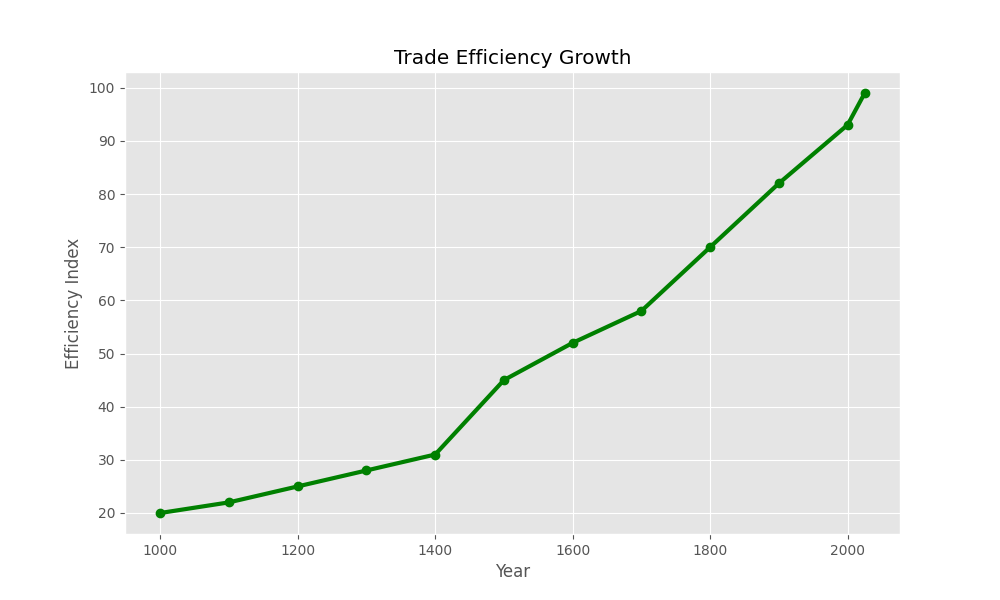

Shows continuous improvement in economic efficiency through historical development.

---

## 📊 Barter vs Money

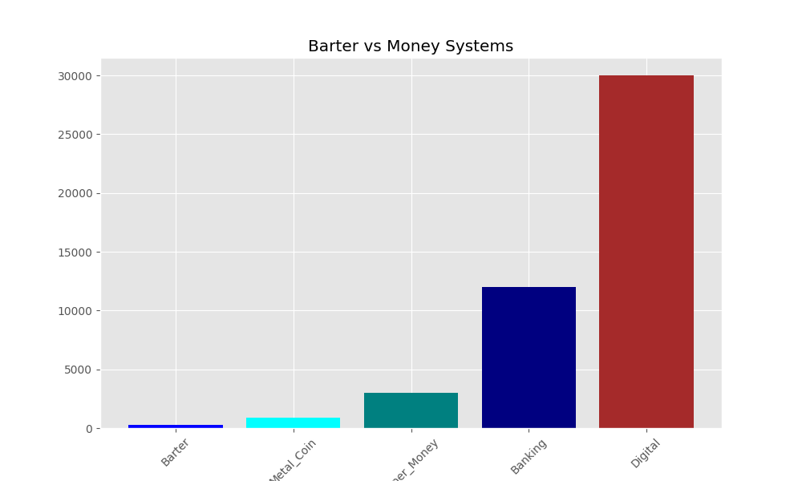

Comparison between barter-based and monetary exchange systems.

---

## 📊 Transaction Success Rate

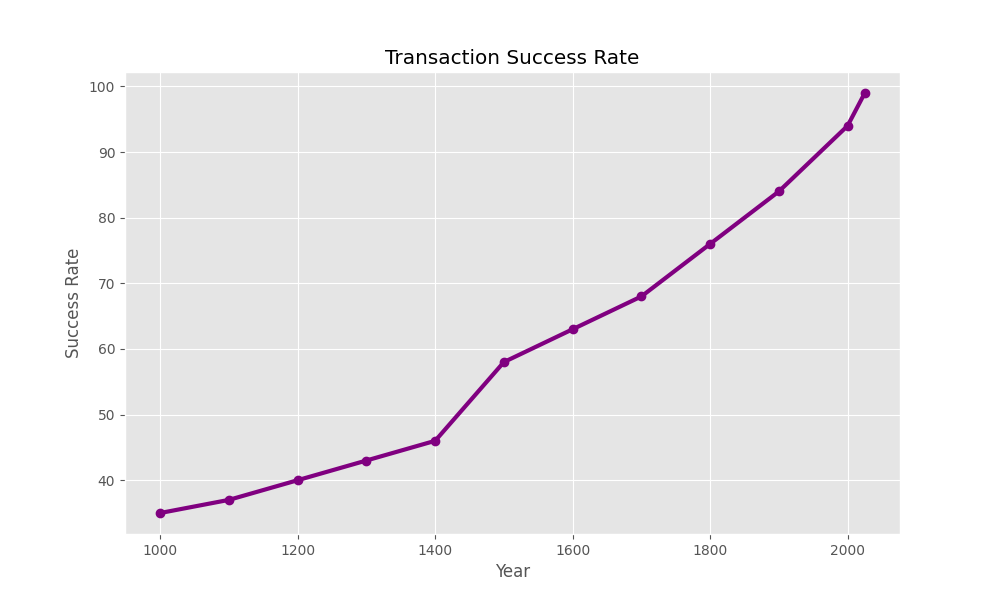

Illustrates increasing transaction completion rates over time.

---

## 📊 Trade Volume Growth

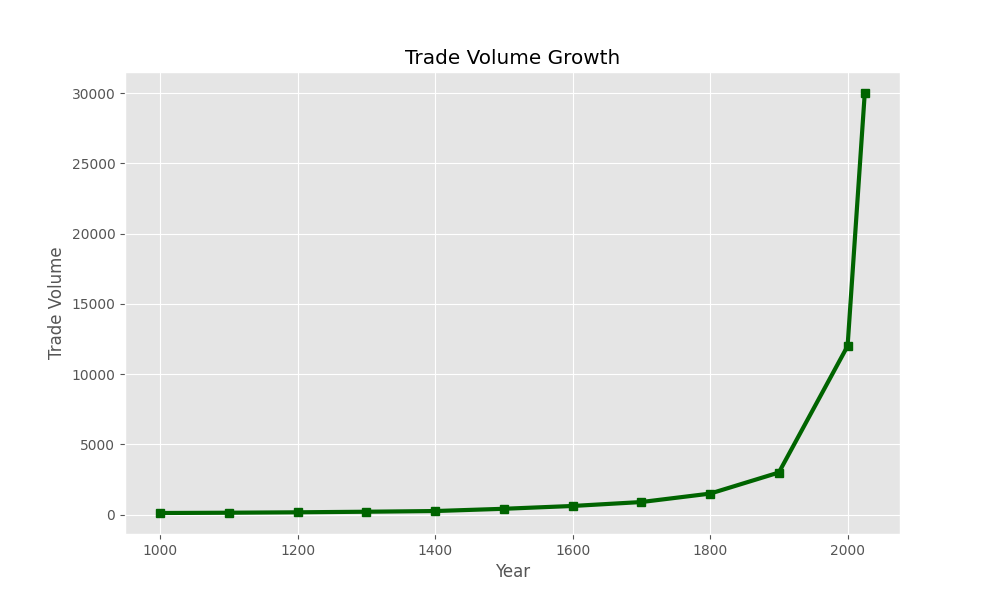

Displays expansion of market activity across economic eras.

---

## 📊 Market Complexity

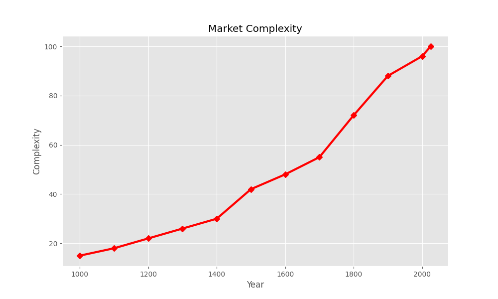

Shows increasing sophistication of economic structures.

---

## 📊 Exchange Evolution

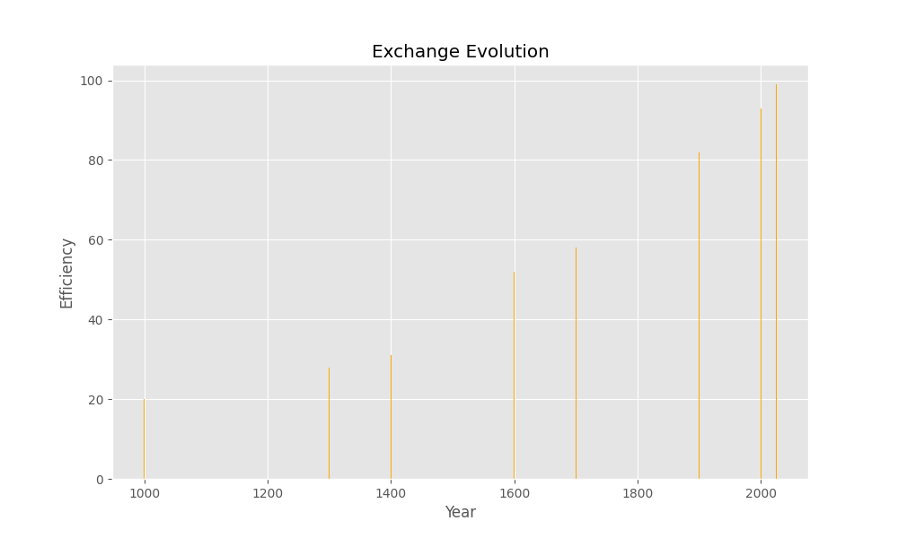

Visual representation of exchange-system transformation.

---

## 📊 Economic Efficiency

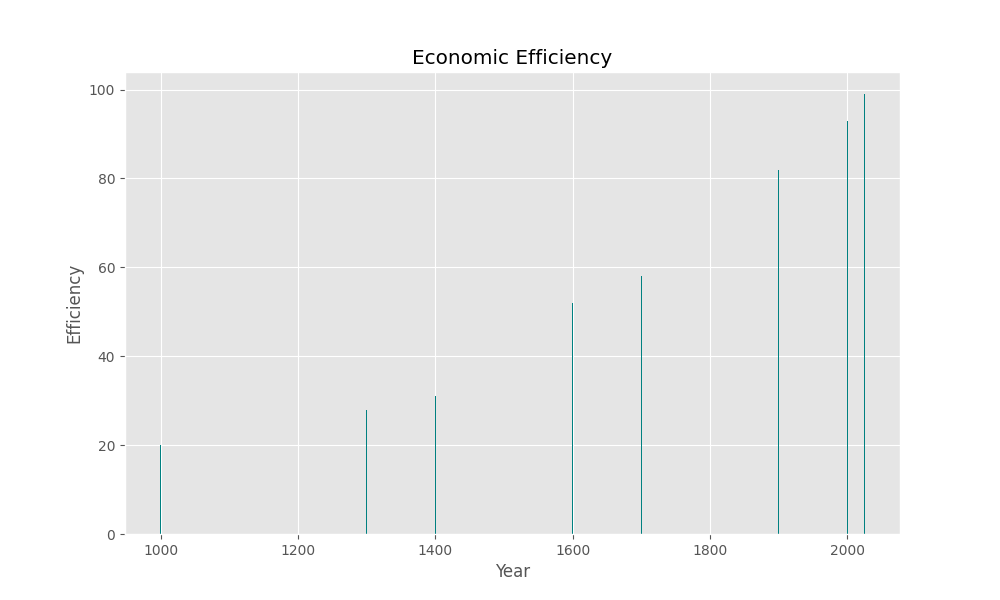

Measures overall productivity improvement across historical periods.

---

## 📊 Population vs Trade

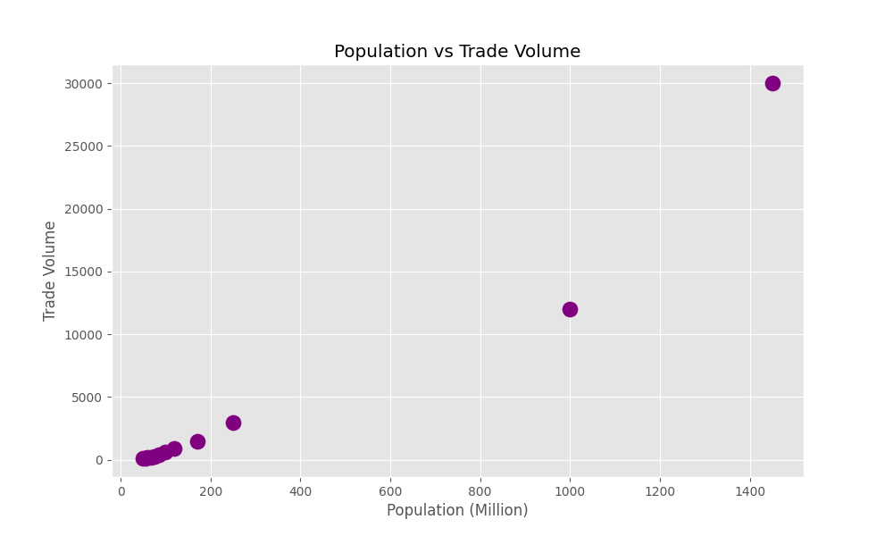

Relationship between population expansion and trade growth.

---

## 📊 Statistical Variance

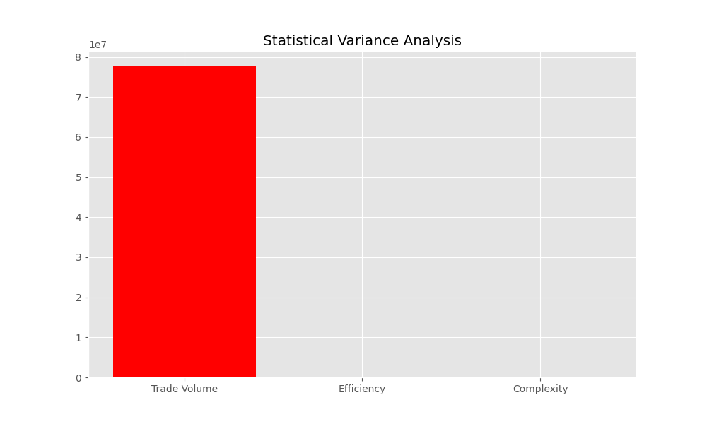

Compares variability among major economic indicators.

---

## 📊 Machine Learning Prediction

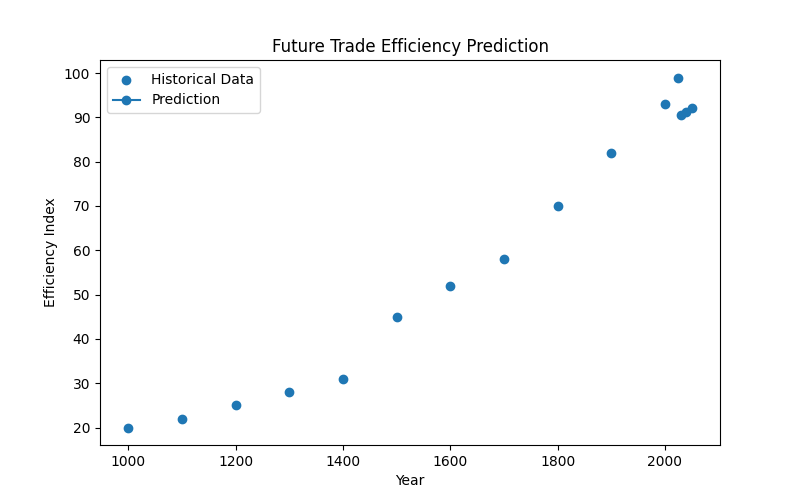

Forecast of future economic efficiency using Linear Regression.

---

## ⚙ Program Execution Output

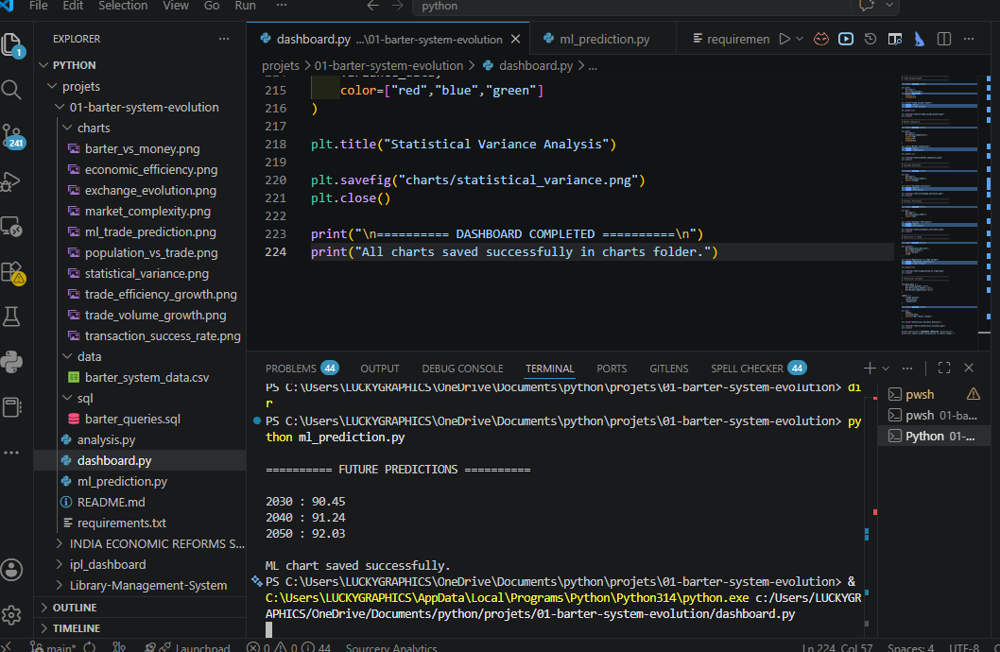

Displays:

- Dataset Inspection
- Summary Statistics
- Mean Analysis
- Median Analysis
- Standard Deviation
- Variance Analysis
- Correlation Matrix
- Economic Findings

---

# 🔍 Key Findings

### 1. Economic Efficiency Improved Dramatically

Trade efficiency increased significantly after the introduction of money and organized financial systems.

### 2. Transaction Success Rates Increased

Money eliminated the double coincidence problem and simplified exchange.

### 3. Market Complexity Expanded

Growing populations required sophisticated institutions and financial structures.

### 4. Trade Volume Grew Rapidly

Economic innovation accelerated commercial activity.

### 5. Strong Positive Correlation Exists

Population growth and trade volume demonstrate a strong positive relationship.

### 6. Digital Systems Achieved Maximum Efficiency

Modern payment networks produce near-frictionless transactions.

### 7. Machine Learning Predicts Continued Growth

Future efficiency forecasts indicate further economic optimization.

---

# 📚 Data Sources & References

This project uses educational, historical, and analytical datasets inspired by publicly available economic research and academic resources.

## Main Sources

- Economic History Research Papers
- Monetary Economics Literature
- International Trade Studies
- World Bank Publications
- IMF Historical Economic Reports
- Development Economics Textbooks
- Banking History References
- Statistics and Econometrics Resources
- Public Educational Datasets
- Academic Economic Journals

---

# 📊 Dataset Inspiration

The dataset is an educational analytical dataset inspired by:

- historical trade systems
- barter economies
- monetary evolution
- banking development
- market expansion
- population growth
- economic efficiency trends
- transaction success improvements
- digital economy development

---

# ⚠ Disclaimer

This project is created for:

- Educational Purposes
- Data Analytics Practice
- Statistical Learning
- Economic Research
- Machine Learning Demonstration
- Historical Economic Visualization

The dataset is a simplified analytical representation designed for learning, visualization, and project development purposes.

---

# 🚀 Future Scope

Future improvements may include:

- Inflation Modeling
- Currency Evolution Analysis
- Banking Expansion Studies
- International Trade Simulation
- GDP Growth Forecasting
- Advanced Machine Learning Models
- Time Series Forecasting
- Economic Network Analysis
- SQL Database Integration
- Interactive Dashboards
- Power BI Integration

---

# 👩‍💻 Author

**Saloni Tiwari**

Economic Analytics • Statistics • Data Science • Python Projects

Focused on building long-term analytical projects combining:

- Economics
- Finance
- Statistics
- Data Analytics
- SQL
- Machine Learning
- Historical Research

---

# ⭐ Project Summary

This project demonstrates the complete evolution of economic exchange systems from ancient barter trade to modern digital economies using:

✅ Python

✅ Pandas

✅ NumPy

✅ Statistics

✅ SQL

✅ Machine Learning

✅ Data Visualization

✅ Economic Analysis

✅ Historical Research

and serves as the foundational project of the **Foundational Economics Series**.
