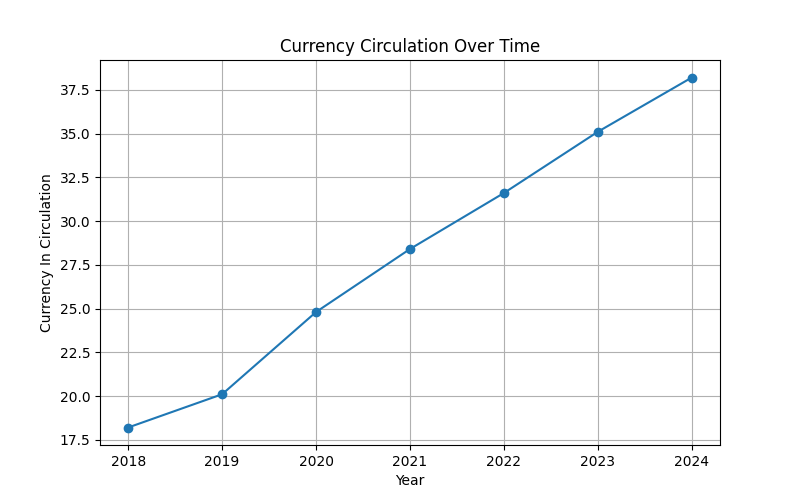
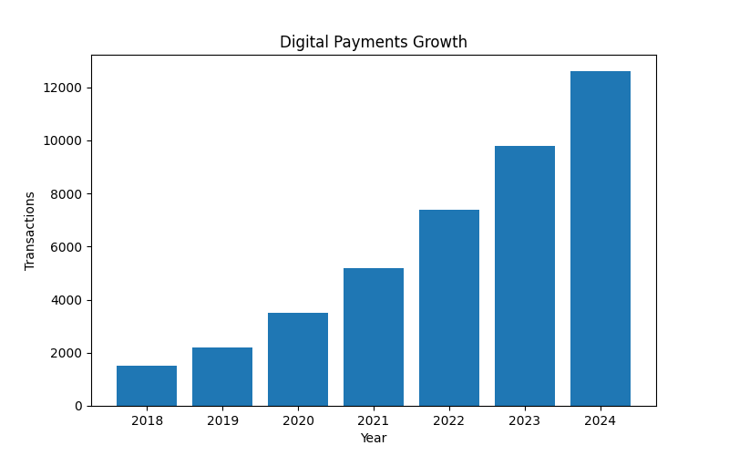
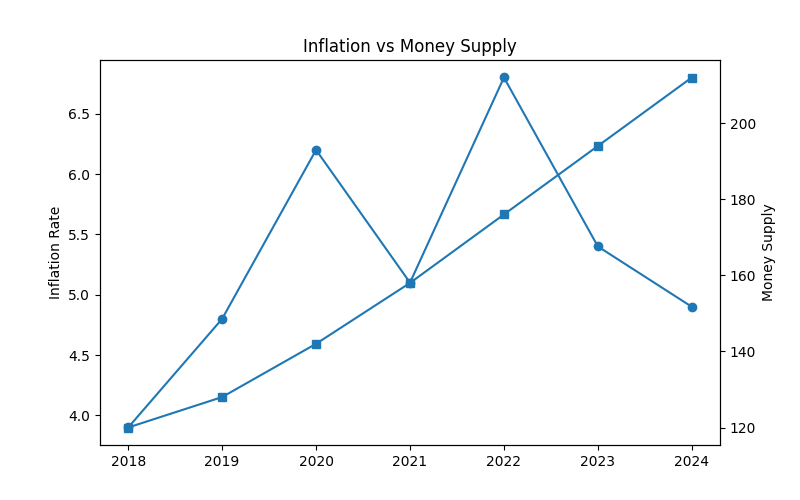
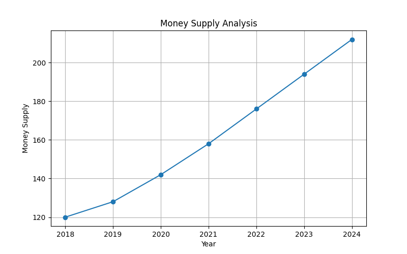
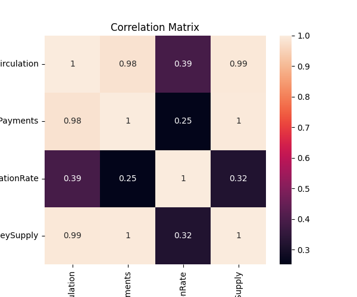
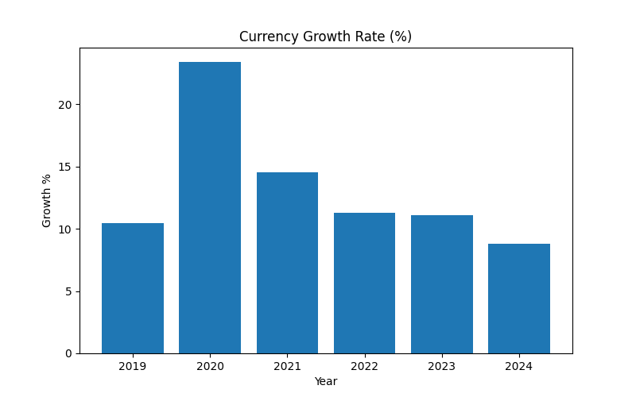
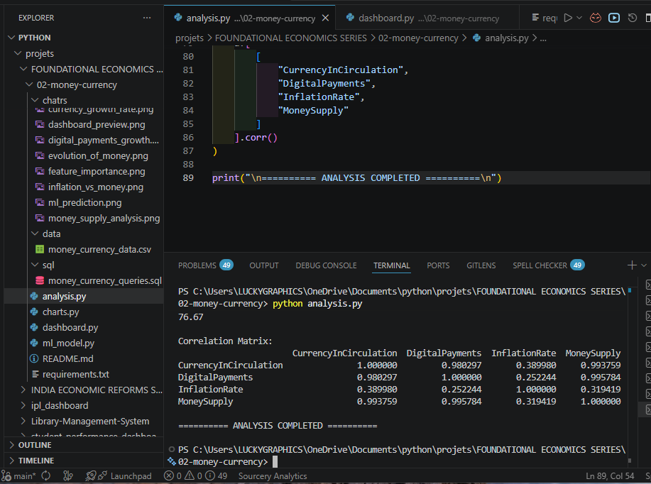
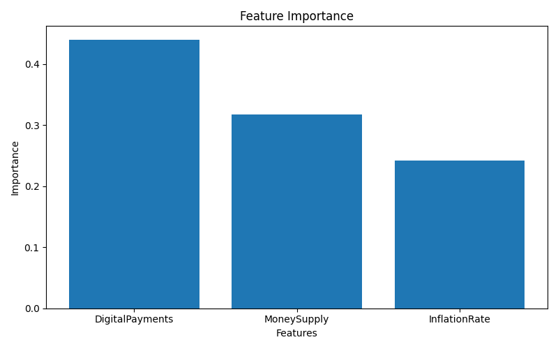
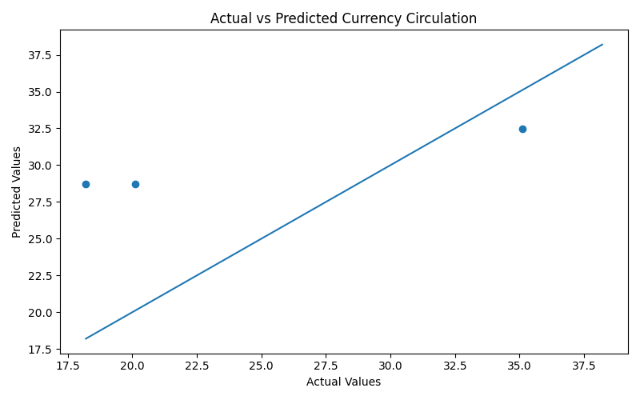

# 💰 Money & Currency Analytics

Understanding the Evolution of Money, Currency Circulation, Digital Payments, Inflation, and Money Supply Through Data Analytics, SQL, Machine Learning, and Interactive Dashboards.

---

## 📌 Project Overview

Money is one of the most important innovations in human history.

This project explores how money evolved from barter systems to modern digital payment ecosystems and analyzes the relationship between:

- Currency Circulation
- Money Supply
- Inflation
- Digital Payments
- Economic Growth Indicators

The project combines:

- Python Analytics
- Statistical Analysis
- Data Visualization
- SQL Queries
- Machine Learning Prediction
- Interactive Streamlit Dashboard

---

## 🎯 Objectives

- Study the evolution of money and currency systems
- Analyze currency circulation trends
- Examine growth of digital payments
- Explore inflation and money supply relationships
- Apply statistical analysis techniques
- Build predictive machine learning models
- Create an interactive economics dashboard

---

# 🏛 Historical Journey of Money

### Stage 1 — Barter System

People exchanged goods directly.

Example:

- Rice ↔ Wheat
- Milk ↔ Cloth

Problems:

- Double coincidence of wants
- Difficult valuation
- Lack of divisibility

---

### Stage 2 — Commodity Money

Items with intrinsic value became mediums of exchange.

Examples:

- Salt
- Cattle
- Metals
- Grain

---

### Stage 3 — Metallic Coins

Governments introduced standardized coins.

Advantages:

- Durable
- Portable
- Widely accepted

---

### Stage 4 — Paper Currency

Currency notes replaced heavy metal coins.

Benefits:

- Easier transactions
- Higher portability
- Government-backed value

---

### Stage 5 — Banking System

Banks enabled:

- Deposits
- Lending
- Credit Creation
- Financial Intermediation

---

### Stage 6 — Digital Payments

Modern systems include:

- UPI
- Mobile Wallets
- Net Banking
- Digital Transfers

Result:

- Faster Transactions
- Financial Inclusion
- Cashless Economy

---

## 📂 Project Structure

```text
02-money-currency/
│
├── data/
│   └── money_currency_data.csv
│
├── charts/
│   ├── analysis_output.png
│   ├── currency_circulation.png
│   ├── digital_payments_growth.png
│   ├── inflation_vs_money.png
│   ├── money_supply_analysis.png
│   ├── correlation_matrix.png
│   ├── currency_growth_rate.png
│   ├── feature_importance.png
│   ├── ml_prediction.png
│   └── dashboard_preview.png
│
├── sql/
│   └── money_currency_queries.sql
│
├── analysis.py
├── charts.py
├── ml_model.py
├── dashboard.py
├── requirements.txt
└── README.md
```

---

# 📊 Dataset Features

| Column | Description |
|----------|----------|
| Year | Observation Year |
| CurrencyInCirculation | Total Currency Circulation |
| DigitalPayments | Digital Payment Volume |
| InflationRate | Annual Inflation Rate |
| MoneySupply | Total Money Supply |

---

# 📈 Statistical Analysis

Performed using:

- Pandas
- NumPy

Key metrics:

- Mean
- Median
- Standard Deviation
- Correlation Analysis
- Growth Rate Analysis

Example Output:

```text
Money Supply Growth Rate (%)

76.67

Correlation Matrix

Currency Circulation ↔ Money Supply
0.99

Currency Circulation ↔ Digital Payments
0.98
```

---

# 📊 Visualizations

The project generates multiple charts.

---

## Currency Circulation Trend

Tracks growth in currency circulation over time.



---

## Digital Payments Growth

Shows increasing adoption of digital payment systems.



---

## Inflation vs Money Supply

Analyzes monetary expansion and inflation relationship.



---

## Money Supply Analysis

Visual representation of monetary growth.



---

## Correlation Matrix

Relationship among economic variables.



---

## Currency Growth Rate

Year-over-year currency expansion.



---

## Terminal Output



---

# 🤖 Machine Learning Prediction

Machine Learning model:

### Random Forest Regressor

Used to predict future currency circulation using:

- Digital Payments
- Inflation Rate
- Money Supply

---

## Feature Importance

Shows most influential economic indicators.



---

## Prediction Accuracy

Actual vs Predicted values comparison.



---

# 🗄 SQL Analysis

Example Queries:

```sql
SELECT *
FROM money_currency_data;

SELECT
AVG(InflationRate)
FROM money_currency_data;

SELECT
MAX(CurrencyInCirculation)
FROM money_currency_data;

SELECT
Year,
DigitalPayments
FROM money_currency_data
ORDER BY Year;
```

---

# 🌐 Interactive Dashboard

Built using:

- Streamlit
- Plotly

Features:

✅ Dataset Explorer

✅ Statistical Summary

✅ KPI Metrics

✅ Currency Trend Analysis

✅ Digital Payment Visualization

✅ Inflation vs Money Supply Analysis

✅ Correlation Analysis

✅ Machine Learning Insights

✅ SQL Query Explorer

---

## Dashboard Preview


---

# 🚀 How To Run

## Install Dependencies

```bash
pip install -r requirements.txt
```

---

## Run Statistical Analysis

```bash
python analysis.py
```

---

## Generate Charts

```bash
python charts.py
```

---

## Run Machine Learning Model

```bash
python ml_model.py
```

---

## Launch Dashboard

```bash
streamlit run dashboard.py
```

---

# 🛠 Technologies Used

### Programming

- Python

### Data Analysis

- Pandas
- NumPy

### Visualization

- Matplotlib
- Plotly

### Machine Learning

- Scikit-Learn

### Dashboard

- Streamlit

### Database

- SQL

---

# 📚 Learning Outcomes

After completing this project:

- Understanding of money evolution
- Economic indicator analysis
- Statistical computation
- Correlation interpretation
- Data visualization skills
- SQL analytical querying
- Machine learning prediction
- Interactive dashboard development

---

# 🎓 Academic Relevance

Relevant for:

- Economics
- Data Science
- Business Analytics
- Statistics
- Financial Analysis
- Public Policy
- Development Studies

---

# 🏁 Conclusion

Money has evolved from simple barter exchanges to sophisticated digital ecosystems.

Through statistical analysis, machine learning, SQL exploration, and interactive dashboards, this project demonstrates how economic data can be transformed into meaningful insights for understanding monetary systems and financial development.

---

### 👩‍💻 Author

**Saloni Tiwari**

IIT Madras BS in Data Science  
B.Sc. Mathematics — Magadh University

GitHub:
https://github.com/25f2005869-glitch
