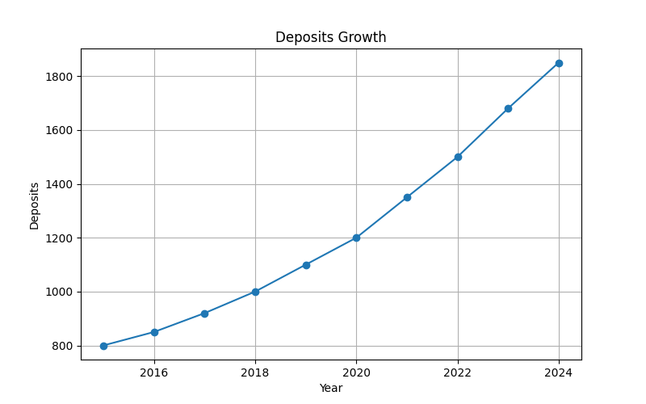
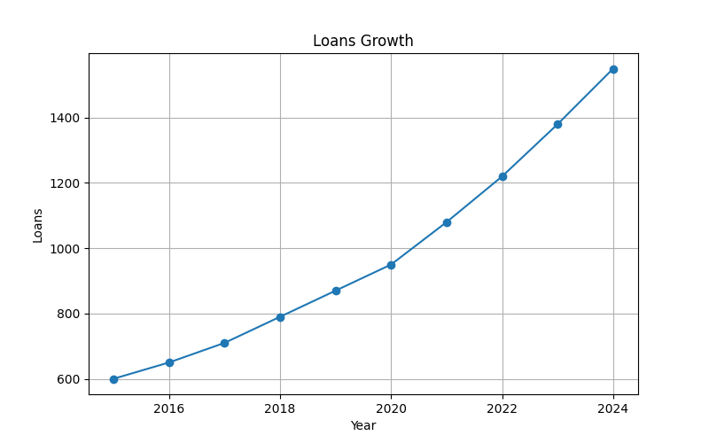
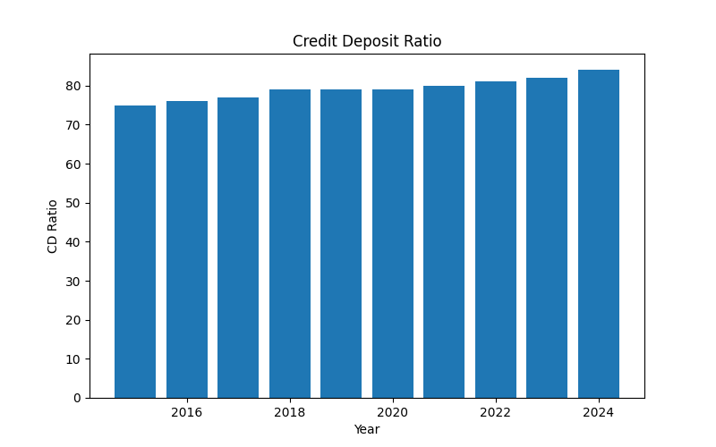
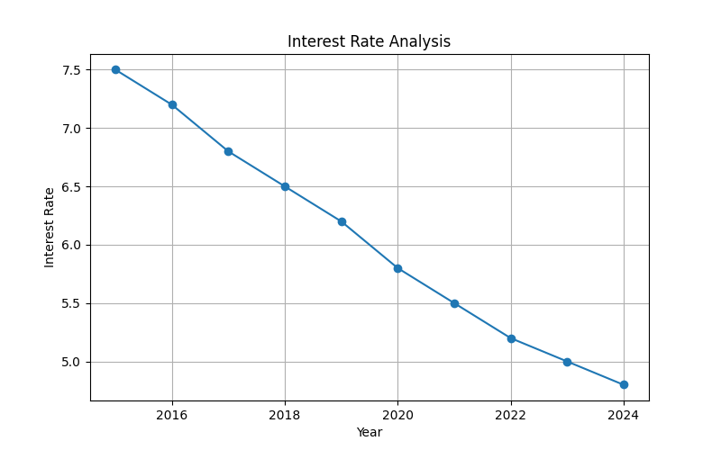
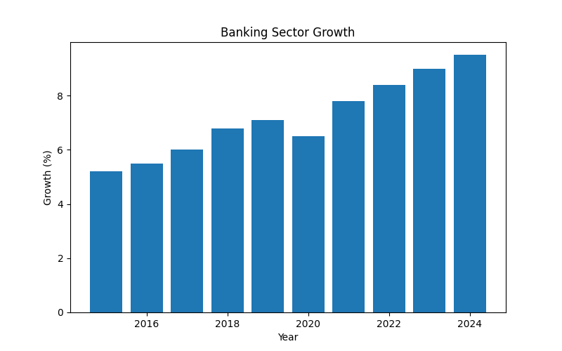
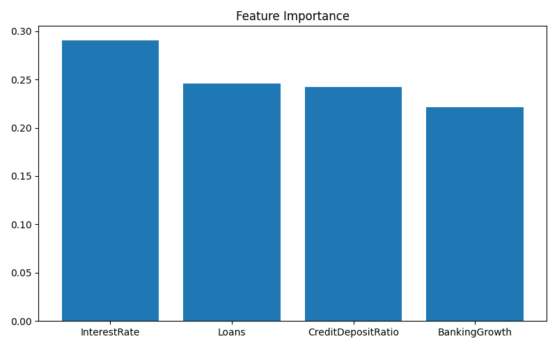
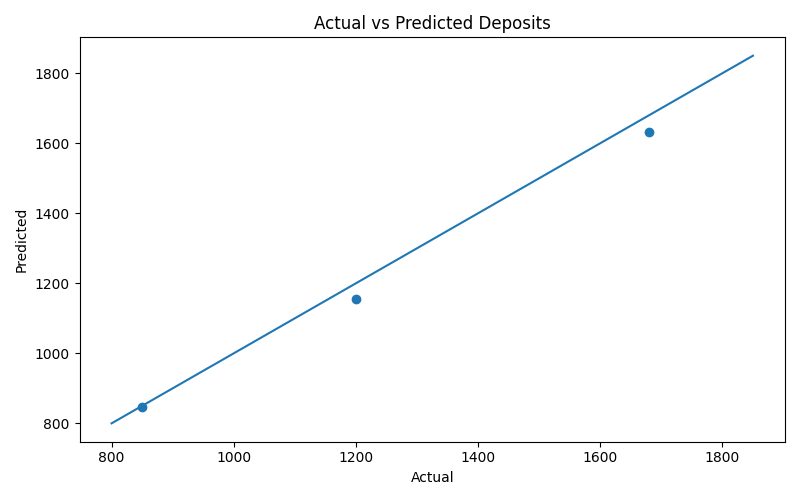

# 🏦 Banking Fundamentals Analytics

## 📌 Project Overview

Banking is the backbone of a modern economy, enabling savings mobilization, credit creation, investment financing, and economic growth. This project analyzes core banking indicators using Data Analytics, Statistics, SQL, Machine Learning, Data Visualization, and an Interactive Streamlit Dashboard.

The project explores deposit growth, loan expansion, credit-deposit ratios, interest rate trends, banking sector performance, and predictive analytics.

---

## 🎯 Objectives

- Analyze banking sector growth trends
- Study deposits and loans growth
- Evaluate Credit-Deposit Ratio (CD Ratio)
- Analyze interest rate movements
- Apply SQL analytics on banking data
- Build predictive machine learning models
- Develop an interactive Streamlit dashboard

---

# 📚 Source of Data

The dataset used in this project is an educational dataset created for learning and analytical purposes based on publicly available banking concepts and trends.

### Reference Sources

- Reserve Bank of India (RBI)  
  https://www.rbi.org.in

- RBI Database on Indian Economy (DBIE)  
  https://dbie.rbi.org.in

- Ministry of Finance, Government of India  
  https://finmin.gov.in

- World Bank Open Data  
  https://data.worldbank.org

- International Monetary Fund (IMF)  
  https://www.imf.org

- Investopedia Banking Resources  
  https://www.investopedia.com

### Note

The dataset is a simplified educational dataset designed for Data Analytics, SQL, Machine Learning, and Dashboard Development practice. It does not represent official banking statistics.

---

# 📂 Project Structure

03-banking-fundamentals/

│

├── data/

│   └── banking_fundamentals_data.csv

│

├── charts/

│   ├── deposits_growth.png

│   ├── loans_growth.png

│   ├── credit_deposit_ratio.png

│   ├── interest_rate_analysis.png

│   ├── banking_sector_growth.png

│   ├── feature_importance.png

│   ├── ml_prediction.png

│   └── dashboard_preview.png

│

├── sql/

│   └── banking_queries.sql

│

├── analysis.py

├── charts.py

├── ml_model.py

├── dashboard.py

├── requirements.txt

└── README.md

---

# 📊 Dataset Description

The dataset contains yearly banking sector indicators.

| Column | Description |
|----------|-------------|
| Year | Observation Year |
| Deposits | Total Bank Deposits |
| Loans | Total Loans Issued |
| CreditDepositRatio | Credit-Deposit Ratio (%) |
| InterestRate | Lending Interest Rate (%) |
| BankingSectorGrowth | Banking Sector Growth (%) |

---

# 📈 Analytics Performed

### 🏦 Deposits Analysis

- Deposit Growth Trend
- Average Deposits
- Growth Rate Analysis

### 💰 Loans Analysis

- Loan Expansion Trend
- Lending Growth Evaluation

### 📊 Credit Deposit Ratio

- Credit Utilization Analysis
- Banking Efficiency Measurement

### 📉 Interest Rate Analysis

- Interest Rate Trend Visualization
- Economic Impact Assessment

### 📈 Banking Sector Growth

- Sector Expansion Trend
- Growth Performance Evaluation

### 🔍 Correlation Analysis

Relationship among:

- Deposits
- Loans
- Interest Rate
- Credit Deposit Ratio
- Banking Sector Growth

---

# 🗄 SQL Analytics

The project includes SQL queries for banking analytics.

### Example Queries

```sql
SELECT *
FROM banking_data;
```

```sql
SELECT AVG(Deposits)
FROM banking_data;
```

```sql
SELECT AVG(Loans)
FROM banking_data;
```

```sql
SELECT MAX(CreditDepositRatio)
FROM banking_data;
```

```sql
SELECT AVG(InterestRate)
FROM banking_data;
```

```sql
SELECT Year, BankingSectorGrowth
FROM banking_data
ORDER BY BankingSectorGrowth DESC;
```

---

# 🤖 Machine Learning Model

Machine Learning is used to predict Banking Sector Growth.

### Algorithm Used

- Random Forest Regressor

### Features

- Deposits
- Loans
- Credit Deposit Ratio
- Interest Rate

### Target

- Banking Sector Growth

### Outputs

- R² Score
- Feature Importance
- Actual vs Predicted Analysis
- Future Growth Prediction

---

# 📊 Visualizations

### Deposits Growth


### Loans Growth


### Credit Deposit Ratio


### Interest Rate Analysis


### Banking Sector Growth


### Feature Importance


### Machine Learning Prediction

---

# 🌐 Interactive Dashboard

The Streamlit Dashboard provides:

### 📋 Dataset Explorer

- Complete banking dataset
- Interactive table view

### 📊 Statistical Summary

- Descriptive Statistics
- Correlation Matrix

### 📈 Banking Analytics

- Deposits Growth
- Loans Growth
- Credit Deposit Ratio
- Interest Rate Analysis
- Banking Sector Growth

### 🤖 Machine Learning Section

- Feature Importance
- Predicted Growth Analysis
- Model Performance

### 🗄 SQL Query Explorer

- Banking SQL Queries
- Query Learning Section

---

# 🛠 Technologies Used

### Programming

- Python

### Data Analysis

- Pandas
- NumPy

### Visualization

- Matplotlib
- Plotly

### Machine Learning

- Scikit-Learn
- Random Forest Regression

### Dashboard

- Streamlit

### Database

- SQL

---

# ▶ How To Run

## Install Dependencies

```bash
pip install -r requirements.txt
```

## Run Analysis

```bash
python analysis.py
```

## Generate Charts

```bash
python charts.py
```

## Run Machine Learning

```bash
python ml_model.py
```

## Launch Dashboard

```bash
streamlit run dashboard.py
```

---

# 📷 Project Outputs

### Terminal Output

```text
Deposits Growth Analysis
Loans Growth Analysis
Credit Deposit Ratio Analysis
Interest Rate Analysis
Correlation Matrix
Banking Sector Growth Analysis
```

### Generated Charts

```text
deposits_growth.png
loans_growth.png
credit_deposit_ratio.png
interest_rate_analysis.png
banking_sector_growth.png
feature_importance.png
ml_prediction.png
```

### Dashboard Output

```text
Interactive Banking Fundamentals Analytics Dashboard
```

---

# 🎓 Learning Outcomes

This project helps understand:

- Banking Fundamentals
- Deposits & Loans Mechanism
- Credit Creation Process
- Interest Rate Dynamics
- Banking Sector Performance
- SQL Analytics
- Data Visualization
- Machine Learning Applications
- Dashboard Development

---

# 🚀 Future Enhancements

- RBI Banking Data Integration
- Bank-wise Comparative Analysis
- NPA Analysis
- Digital Banking Analytics
- Financial Inclusion Metrics
- Forecasting Models
- Advanced Machine Learning Algorithms

---

# 👩‍💻 Author

**Saloni Tiwari**

🎓 IIT Madras BS in Data Science  
🎓 B.Sc Mathematics (Magadh University)

### Skills

- Python
- NumPy
- Pandas
- Matplotlib
- SQL
- Statistics
- Data Analytics
- Machine Learning (Learning)
- Data Structures & Algorithms (Learning)
- DBMS (Learning)

---

# ⭐ Project Theme

> Banking institutions mobilize savings, create credit, support businesses, and accelerate economic development. Understanding banking fundamentals provides valuable insights into how financial systems drive national growth.
