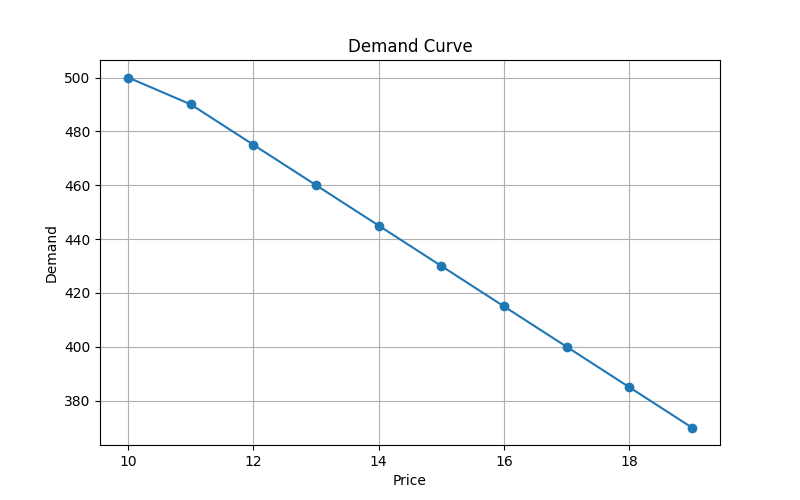
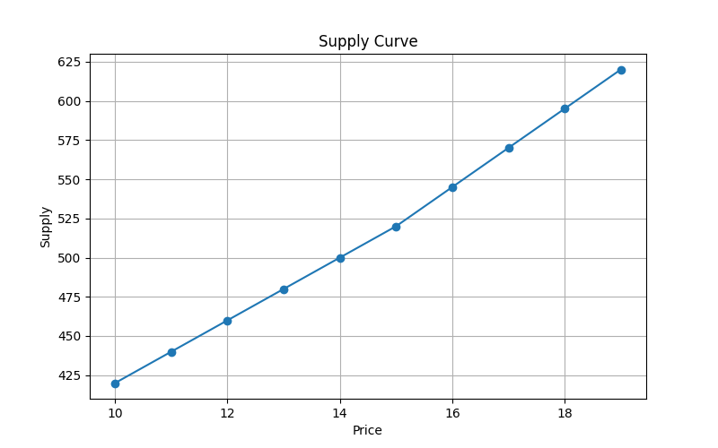
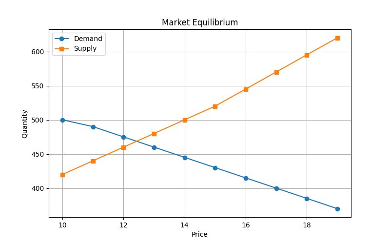
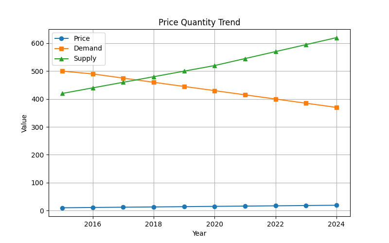
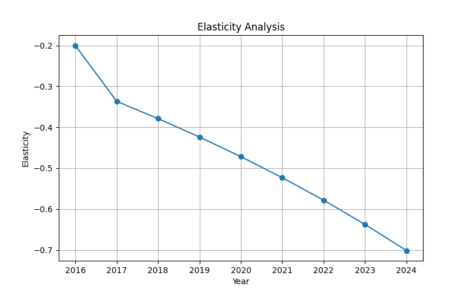
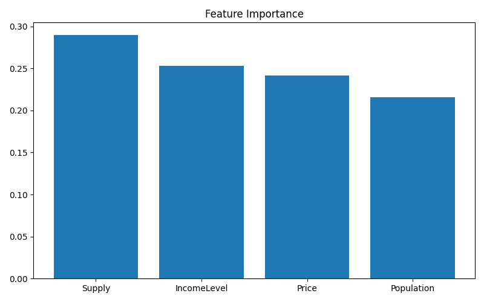
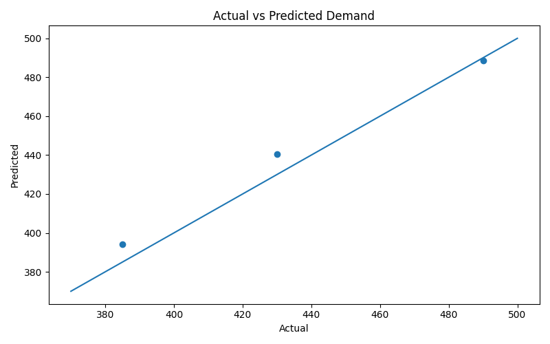
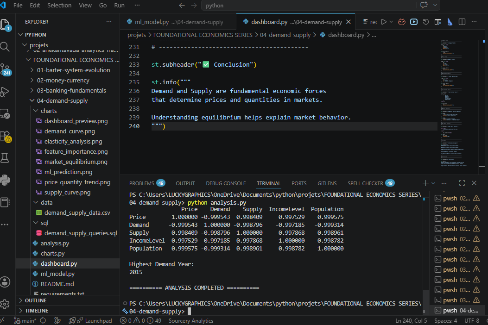

# 📈 Demand & Supply Analytics

## 📌 Project Overview

Demand and Supply are the foundation of microeconomics and market behavior. Every market price, shortage, surplus, and production decision is influenced by the interaction between demand and supply.

This project analyzes demand, supply, pricing, market equilibrium, elasticity, and economic trends using Data Analytics, Statistics, SQL, Machine Learning, Data Visualization, and an Interactive Streamlit Dashboard.

The project demonstrates how economic concepts can be transformed into data-driven insights through Python-based analytics.

---

## 🎯 Objectives

- Understand the Law of Demand
- Understand the Law of Supply
- Analyze Market Equilibrium
- Study Price and Quantity Relationships
- Explore Elasticity Concepts
- Perform Statistical Analysis
- Apply SQL Analytics
- Build Machine Learning Prediction Models
- Develop Interactive Dashboards

---

# 📚 Source of Data

The dataset used in this project is an educational dataset created for learning and analytical purposes based on publicly available economic concepts and trends.

### Reference Sources

- NCERT Economics
- Reserve Bank of India (RBI)
- World Bank Open Data
- International Monetary Fund (IMF)
- Ministry of Statistics and Programme Implementation (MOSPI)
- Investopedia Economics Resources

### Note

The dataset is a simplified educational dataset designed for Data Analytics, SQL, Machine Learning, and Dashboard Development practice. It does not represent official economic statistics.

---

# 📂 Project Structure

04-demand-supply/

│

├── data/

│   └── demand_supply_data.csv

│

├── charts/

│   ├── demand_curve.png

│   ├── supply_curve.png

│   ├── market_equilibrium.png

│   ├── price_quantity_trend.png

│   ├── elasticity_analysis.png

│   ├── feature_importance.png

│   ├── ml_prediction.png

│   └── dashboard_preview.png

│

├── sql/

│   └── demand_supply_queries.sql

│

├── analysis.py

├── charts.py

├── ml_model.py

├── dashboard.py

├── requirements.txt

└── README.md

---

# 📊 Dataset Description

The dataset contains yearly observations related to market demand, supply, pricing, income levels, and population growth.

| Column | Description |
|----------|-------------|
| Year | Observation Year |
| Price | Market Price |
| Demand | Quantity Demanded |
| Supply | Quantity Supplied |
| IncomeLevel | Consumer Income Level |
| Population | Population Size |

---

# 📈 Economic Concepts Covered

## Law of Demand

As price increases, quantity demanded generally decreases.

Price ↑ → Demand ↓

---

## Law of Supply

As price increases, producers are willing to supply more goods.

Price ↑ → Supply ↑

---

## Market Equilibrium

Market equilibrium occurs where:

Demand = Supply

At equilibrium:

- No shortage
- No surplus
- Stable market price

---

## Price Elasticity

Elasticity measures responsiveness of demand to price changes.

Elastic Demand:
- Large response to price change

Inelastic Demand:
- Small response to price change

---

# 📊 Statistical Analysis

The project performs:

- Descriptive Statistics
- Mean Analysis
- Growth Rate Analysis
- Market Gap Analysis
- Correlation Analysis
- Trend Identification

### Example Outputs

```text
Average Demand

Average Supply

Average Price

Demand Growth Rate

Supply Growth Rate

Market Gap Analysis

Correlation Matrix
```

---

# 🗄 SQL Analytics

The project includes SQL queries for economic analysis.

### Example Queries

```sql
SELECT *
FROM demand_supply_data;
```

```sql
SELECT AVG(Demand)
FROM demand_supply_data;
```

```sql
SELECT AVG(Supply)
FROM demand_supply_data;
```

```sql
SELECT MAX(Demand)
FROM demand_supply_data;
```

```sql
SELECT MAX(Supply)
FROM demand_supply_data;
```

```sql
SELECT Year,
Price,
Demand,
Supply
FROM demand_supply_data;
```

---

# 🤖 Machine Learning Model

Machine Learning is used to predict future demand levels.

### Algorithm Used

- Random Forest Regressor

### Features

- Price
- Supply
- Income Level
- Population

### Target

- Demand

### Outputs

- R² Score
- Future Demand Prediction
- Feature Importance Analysis
- Actual vs Predicted Comparison

---

# 📊 Visualizations

### Demand Curve



Visualizes the inverse relationship between price and demand.

---

### Supply Curve



Visualizes the positive relationship between price and supply.

---

### Market Equilibrium



Shows the interaction between demand and supply curves.

---

### Price Quantity Trend



Tracks long-term market trends.

---

### Elasticity Analysis



Measures responsiveness of demand to price changes.

---

### Feature Importance



Displays the most important variables influencing demand.

---

### Machine Learning Prediction



Compares actual demand values with predicted values.

---

### Terminal Output



---

# 🌐 Interactive Dashboard

The Streamlit Dashboard provides:

### 📋 Dataset Explorer

- Interactive dataset viewing

### 📊 Statistical Summary

- Descriptive statistics
- Key indicators

### 📈 Demand Analysis

- Demand trends
- Demand curve visualization

### 📊 Supply Analysis

- Supply trends
- Supply curve visualization

### ⚖ Market Equilibrium

- Demand vs Supply comparison

### 📉 Elasticity Analysis

- Price responsiveness insights

### 🤖 Machine Learning Results

- Predictions
- Feature Importance

### 🗄 SQL Query Explorer

- Economic SQL queries

---

# 🛠 Technologies Used

### Programming

- Python

### Data Analysis

- Pandas
- NumPy

### Visualization

- Matplotlib
- Plotly

### Machine Learning

- Scikit-Learn
- Random Forest Regression

### Dashboard

- Streamlit

### Database

- SQL

---

# ▶ How To Run

## Install Dependencies

```bash
pip install -r requirements.txt
```

## Run Analysis

```bash
python analysis.py
```

## Generate Charts

```bash
python charts.py
```

## Run Machine Learning

```bash
python ml_model.py
```

## Launch Dashboard

```bash
streamlit run dashboard.py
```

---

# 📷 Project Outputs

### Terminal Output

```text
Average Demand
Average Supply
Average Price

Demand Growth Rate
Supply Growth Rate

Market Gap Analysis

Correlation Matrix
```

### Generated Charts

```text
demand_curve.png
supply_curve.png
market_equilibrium.png
price_quantity_trend.png
elasticity_analysis.png
feature_importance.png
ml_prediction.png
```

### Dashboard Output

```text
Interactive Demand & Supply Analytics Dashboard
```

---

# 🎓 Learning Outcomes

This project helps understand:

- Demand Theory
- Supply Theory
- Market Equilibrium
- Elasticity Concepts
- Consumer Behavior
- Producer Behavior
- Economic Data Analysis
- SQL Analytics
- Machine Learning Prediction
- Dashboard Development

---

# 🚀 Future Enhancements

- Consumer Preference Analysis
- Market Shock Simulation
- Inflation Impact on Demand
- Supply Chain Analytics
- Advanced Forecasting Models
- Real Economic Data Integration
- Time Series Forecasting

---

# 👩‍💻 Author

**Saloni Tiwari**

🎓 IIT Madras BS in Data Science  
🎓 B.Sc Mathematics (Magadh University)

### Skills

- Python
- NumPy
- Pandas
- Matplotlib
- SQL
- Statistics
- Data Analytics
- Machine Learning (Learning)
- Data Structures & Algorithms (Learning)
- DBMS (Learning)

---

# ⭐ Project Theme

> Demand and Supply determine market outcomes. Understanding their interaction helps explain pricing, production decisions, consumer behavior, shortages, surpluses, and the efficient allocation of resources in an economy.
