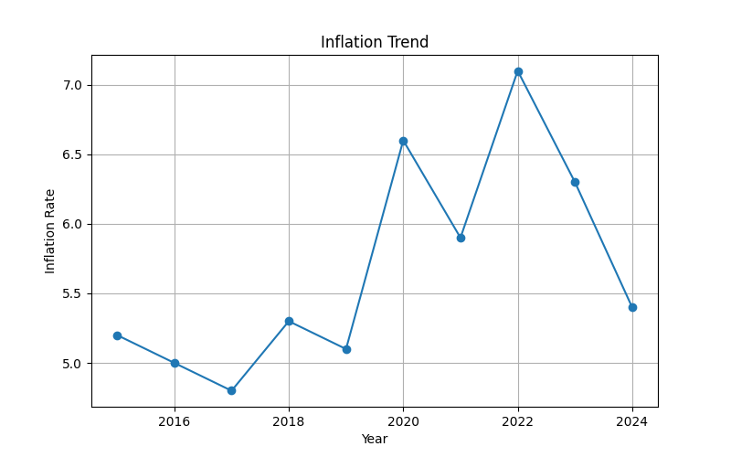
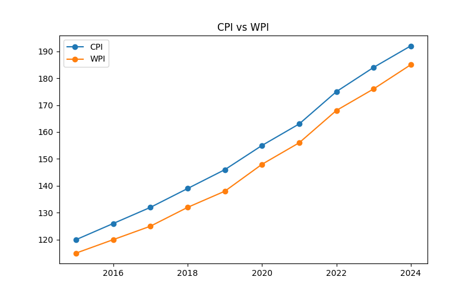
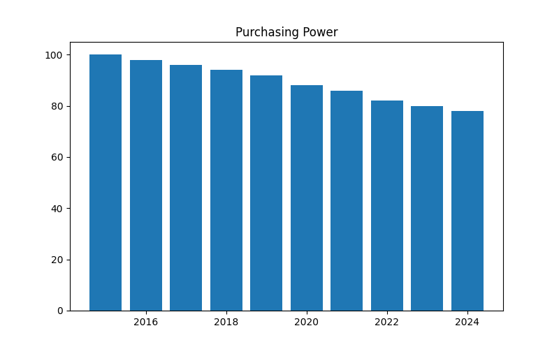
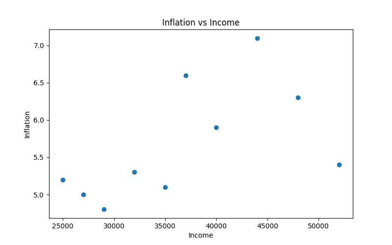
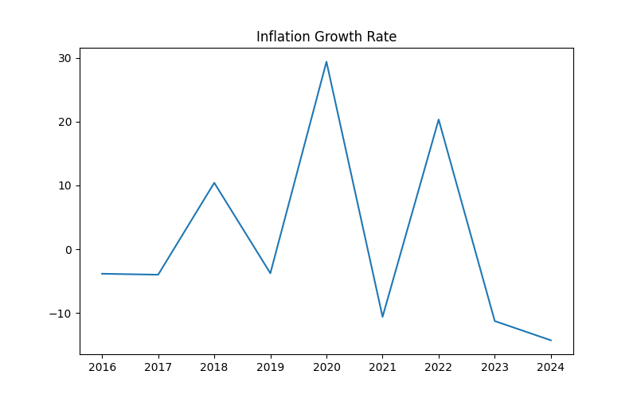
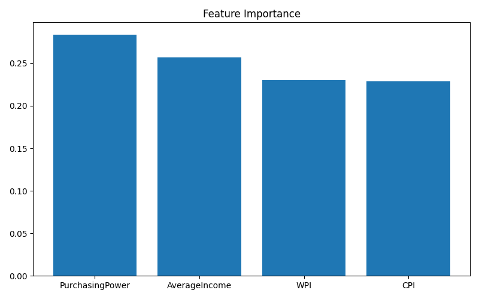
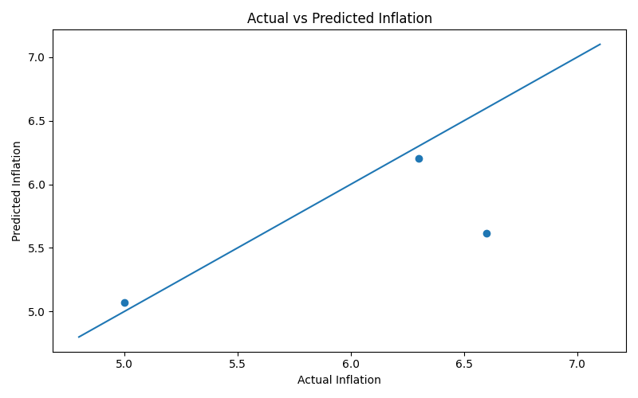

# 📈 Inflation Analytics

## 📖 Project Overview

Inflation is one of the most important economic indicators influencing purchasing power, household budgets, savings, investment decisions, business planning, and overall economic stability.

This project analyzes inflation trends using Consumer Price Index (CPI), Wholesale Price Index (WPI), purchasing power, income growth, statistical analysis, SQL analytics, machine learning predictions[...]

The objective is to transform inflation-related economic concepts into practical data analytics applications using Python and modern analytical tools.

---

# 🎯 Objectives

- Analyze inflation trends over time
- Compare CPI and WPI movements
- Study purchasing power changes
- Examine inflation-income relationships
- Perform statistical analysis
- Conduct SQL-based economic analytics
- Build machine learning prediction models
- Develop interactive dashboards
- Understand real-world inflation dynamics

---

# 📚 Source of Data

The dataset used in this project is an educational dataset created for learning and analytical purposes based on publicly available economic concepts and trends.

## Reference Sources

- Reserve Bank of India (RBI)
- Ministry of Statistics and Programme Implementation (MOSPI)
- World Bank Open Data
- International Monetary Fund (IMF)
- OECD Inflation Statistics
- Economic Survey of India
- Investopedia Economics Resources

## Dataset Nature

- Educational Dataset
- Publicly Inspired Economic Indicators
- Not Official Government Statistics
- Intended for Learning and Analytics Practice

---

# 🛠 Technologies Used

## Programming

- Python

## Data Analysis

- Pandas
- NumPy

## Visualization

- Matplotlib
- Plotly

## Machine Learning

- Scikit-Learn
- Random Forest Regressor

## Dashboard Development

- Streamlit

## Database Analytics

- SQL

---

# 📂 Project Structure

```text
05-inflation-analytics/
│
├── data/
│   └── inflation_data.csv
│
├── charts/
│   ├── inflation_trend.png
│   ├── cpi_vs_wpi.png
│   ├── purchasing_power.png
│   ├── inflation_vs_income.png
│   ├── inflation_growth_rate.png
│   ├── feature_importance.png
│   ├── ml_prediction.png
│   ├── dashboard_preview.png
│   └── terminal_output.png
│
├── sql/
│   └── inflation_queries.sql
│
├── analysis.py
├── charts.py
├── ml_model.py
├── dashboard.py
├── requirements.txt
└── README.md
```

---

# 📊 Dataset Description

The dataset contains yearly inflation-related economic indicators.

| Column | Description |
|----------|-------------|
| Year | Observation Year |
| CPI | Consumer Price Index |
| WPI | Wholesale Price Index |
| InflationRate | Annual Inflation Rate (%) |
| AverageIncome | Average Income Level |
| PurchasingPower | Purchasing Power Index |

---

# 📈 Economic Concepts Covered

## Inflation

A sustained increase in the general price level of goods and services over time.

### Effects

- Higher Cost of Living
- Reduced Purchasing Power
- Impact on Savings
- Impact on Investments
- Influence on Economic Growth

---

## Consumer Price Index (CPI)

Measures changes in prices paid by consumers.

Used to:

- Track Inflation
- Adjust Salaries
- Measure Cost of Living

---

## Wholesale Price Index (WPI)

Measures changes in wholesale market prices.

Used to:

- Track Producer Costs
- Monitor Price Trends
- Analyze Supply-Side Inflation

---

## Purchasing Power

Purchasing power indicates how many goods and services a unit of currency can buy.

Inflation generally reduces purchasing power over time.

---

# 📉 Statistical Analysis

The project performs:

- Descriptive Statistics
- Mean Analysis
- Trend Analysis
- Inflation Growth Analysis
- Correlation Analysis
- Purchasing Power Evaluation
- Income Comparison Analysis

### Example Metrics

- Average Inflation Rate
- Average CPI
- Average WPI
- Average Income
- Inflation Growth Rate
- Correlation Matrix

---

# 📊 Data Visualizations

The project automatically generates the following charts.

---

## Terminal Output


---

## 1. Inflation Trend



Visualizes inflation movement across years.

---

## 2. CPI vs WPI Analysis



Compares consumer and wholesale price indices.

---

## 3. Purchasing Power Analysis



Shows how inflation impacts purchasing power.

---

## 4. Inflation vs Income



Examines income growth relative to inflation.

---

## 5. Inflation Growth Rate



Tracks year-to-year inflation changes.

---

## 6. Feature Importance



Displays important variables influencing inflation predictions.

---

## 7. Machine Learning Prediction



Compares actual and predicted inflation values.

---

# 🤖 Machine Learning Model

The project uses Machine Learning to predict future inflation trends.

## Algorithm

Random Forest Regressor

## Features

- CPI
- WPI
- Average Income
- Purchasing Power

## Target

- Inflation Rate

## Outputs

- R² Score
- Future Inflation Forecast
- Feature Importance
- Actual vs Predicted Comparison

### Example Prediction Output

```text
========== ML RESULTS ==========

R2 Score: 0.91

Predicted Inflation Rate

2025 : 5.82

2026 : 6.04

========== MODEL COMPLETED ==========
```

---

# 🗄 SQL Analytics

The project includes SQL queries for inflation analysis.

### Example Queries

```sql
SELECT *
FROM inflation_data;
```

```sql
SELECT AVG(InflationRate)
FROM inflation_data;
```

```sql
SELECT AVG(CPI)
FROM inflation_data;
```

```sql
SELECT AVG(WPI)
FROM inflation_data;
```

```sql
SELECT *
FROM inflation_data
WHERE InflationRate > 6;
```

```sql
SELECT Year,
       InflationRate,
       AverageIncome
FROM inflation_data;
```

### SQL Insights

- Average Inflation
- CPI Analysis
- WPI Analysis
- Income Analysis
- Purchasing Power Trends
- Inflation Ranking
- Economic Summary Reports

---

# 📷 Project Outputs

## Terminal Output

Running:

```bash
python analysis.py
```

Example:

```text
========== INFLATION ANALYSIS ==========

Average Inflation Rate:
5.67

Average CPI:
153.20

Average WPI:
146.50

Average Income:
37900

Inflation Growth Rate:
3.85

Correlation Matrix:
...

========== ANALYSIS COMPLETED ==========
```

---

## Generated Charts

Running:

```bash
python charts.py
```

Creates:

```text
inflation_trend.png
cpi_vs_wpi.png
purchasing_power.png
inflation_vs_income.png
inflation_growth_rate.png
feature_importance.png
ml_prediction.png
```

---

## Machine Learning Output

Running:

```bash
python ml_model.py
```

Generates:

```text
Future Inflation Prediction
Feature Importance Analysis
Actual vs Predicted Visualization
R² Score Evaluation
```

---

## Dashboard Output

Running:

```bash
streamlit run dashboard.py
```

Launches an interactive dashboard featuring:

- Dataset Explorer
- Statistical Summary
- KPI Metrics
- Inflation Trend Analysis
- CPI vs WPI Analysis
- Purchasing Power Analysis
- Inflation vs Income Analysis
- Correlation Matrix
- Machine Learning Results
- SQL Query Explorer
- Economic Insights

Dashboard Screenshot:

```text
charts/dashboard_preview.png
```

---

# 🌐 Dashboard Features

### 📋 Dataset Explorer

Explore complete inflation dataset.

### 📊 Statistical Summary

View descriptive statistics instantly.

### 📈 Inflation Trend

Analyze inflation movement across years.

### 📉 CPI vs WPI Analysis

Compare consumer and wholesale inflation indicators.

### 💰 Purchasing Power Analysis

Understand the impact of inflation on consumers.

### 🤖 Machine Learning Results

Explore inflation forecasts and model outputs.

### 🗄 SQL Query Explorer

Review economic SQL queries and insights.

---

# ▶ How To Run

## Install Dependencies

```bash
pip install -r requirements.txt
```

## Run Statistical Analysis

```bash
python analysis.py
```

## Generate Charts

```bash
python charts.py
```

## Run Machine Learning

```bash
python ml_model.py
```

## Launch Dashboard

```bash
streamlit run dashboard.py
```

---

# 🎓 Learning Outcomes

After completing this project, learners will understand:

- Inflation Fundamentals
- CPI and WPI Analysis
- Purchasing Power Concepts
- Income vs Inflation Dynamics
- Statistical Analysis Techniques
- SQL Analytics
- Data Visualization
- Machine Learning Prediction
- Dashboard Development
- Economic Decision Making

---

# 🌍 Real-World Applications

This project can be applied in:

- Economic Research
- Public Policy Analysis
- Academic Learning
- Financial Planning
- Business Decision Making
- Data Analytics Training
- Dashboard Development Practice

---

# 👩‍💻 Author

**Saloni Tiwari**

🎓 IIT Madras BS in Data Science

🎓 B.Sc Mathematics (Magadh University)

### Skills

- Python
- NumPy
- Pandas
- Matplotlib
- SQL
- Statistics
- Data Analytics
- Machine Learning (Learning)
- Data Structures & Algorithms (Learning)
- DBMS (Learning)

---

# ⭐ Project Status

✅ Completed

Part of the **Foundational Economics Series**, a collection of economics analytics projects built using Python, Statistics, SQL, Machine Learning, Data Visualization, and Interactive Dashboards.

---

## 🚀 Learning Economics Through Data Analytics
