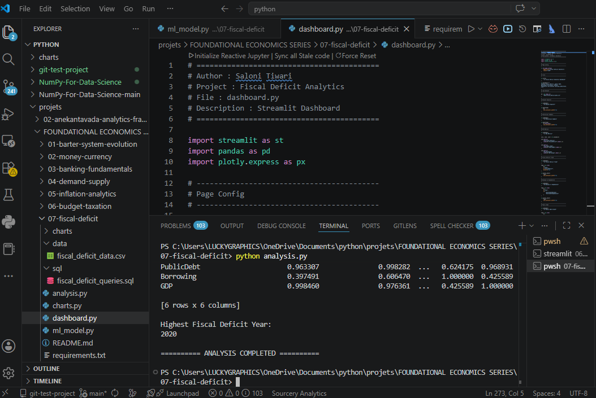
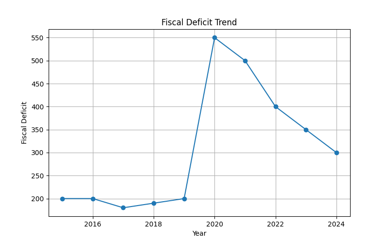
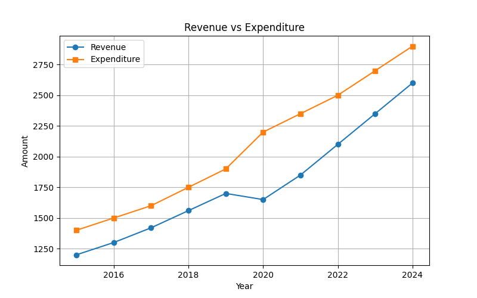
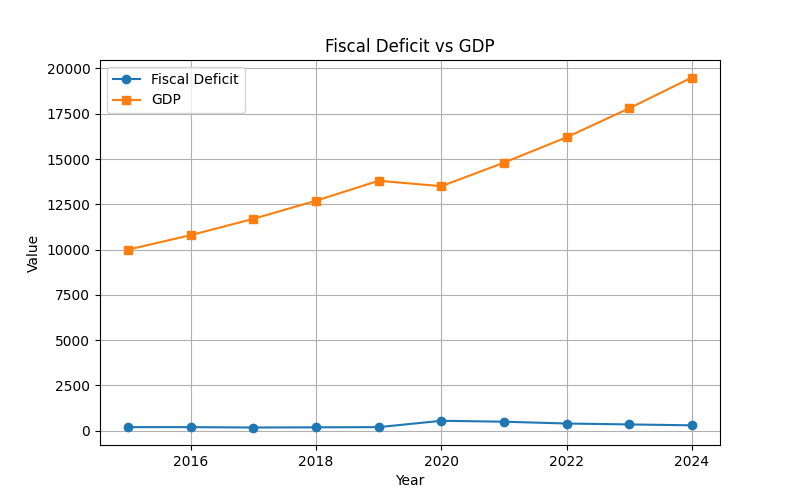
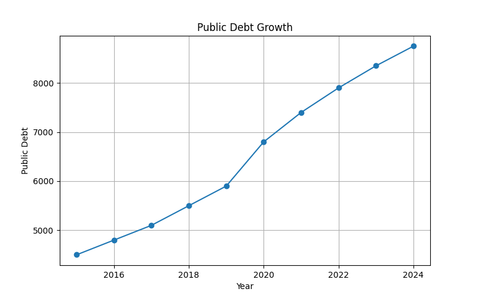
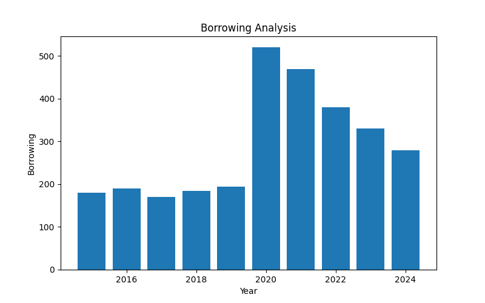
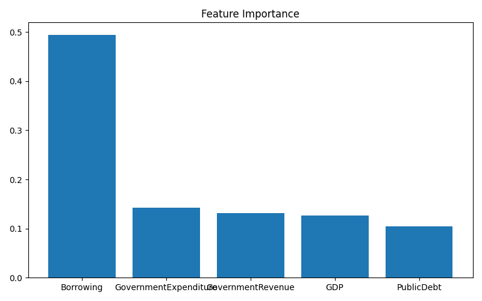
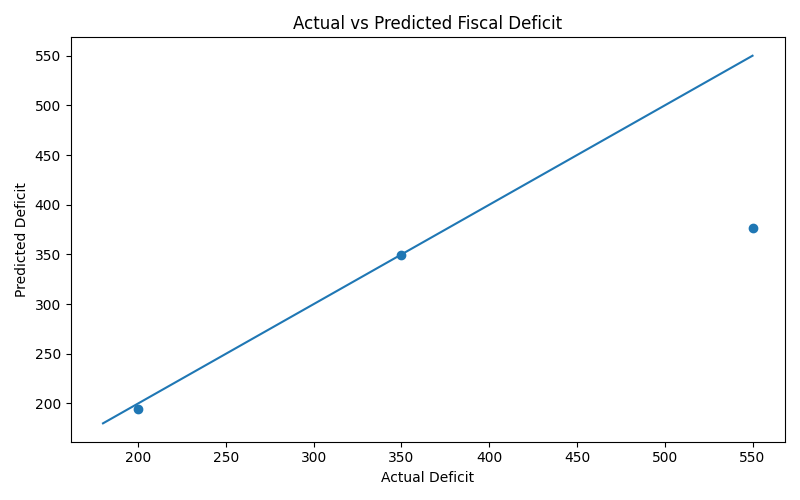

# 📉 Fiscal Deficit Analytics

## 📖 Project Overview

Fiscal Deficit is one of the most important indicators of public finance and economic stability. It occurs when government expenditure exceeds government revenue, requiring borrowing to finance the gap.

This project analyzes fiscal deficits, public debt, government borrowing, revenue, expenditure, GDP trends, and fiscal sustainability using Data Analytics, Statistics, SQL, Machine Learning, Data Visualization, and an interactive dashboard.

The objective is to transform fiscal policy concepts into practical analytics applications using Python and modern data science tools.

---

# 🎯 Objectives

- Analyze fiscal deficit trends
- Study government revenue and expenditure
- Evaluate public debt growth
- Examine borrowing patterns
- Compare fiscal deficit with GDP
- Perform statistical analysis
- Apply SQL analytics
- Build machine learning prediction models
- Develop interactive dashboards

---

# 📚 Source of Data

The dataset used in this project is an educational dataset created for learning and analytical purposes based on publicly available fiscal policy concepts and trends.

## Reference Sources

- Ministry of Finance
- Union Budget Documents
- Economic Survey of India
- Reserve Bank of India (RBI)
- RBI Database on Indian Economy (DBIE)
- World Bank Open Data
- International Monetary Fund (IMF)
- IMF Fiscal Monitor
- Investopedia Public Finance Resources

## Dataset Nature

- Educational Dataset
- Publicly Inspired Economic Indicators
- Learning Purpose Only
- Not Official Government Statistics

---

# 🛠 Technologies Used

## Programming

- Python

## Data Analysis

- Pandas
- NumPy

## Visualization

- Matplotlib
- Plotly

## Machine Learning

- Scikit-Learn
- Random Forest Regressor

## Dashboard Development

- Streamlit

## Database Analytics

- SQL

---

# 📂 Project Structure

```text
07-fiscal-deficit/
│
├── data/
│   └── fiscal_deficit_data.csv
│
├── charts/
│   ├── fiscal_deficit_trend.png
│   ├── revenue_vs_expenditure.png
│   ├── fiscal_deficit_vs_gdp.png
│   ├── public_debt_growth.png
│   ├── borrowing_analysis.png
│   ├── feature_importance.png
│   ├── ml_prediction.png
│   ├── dashboard_preview.png
│   └── fiscal-deficit_terminal_output1.png
│
├── sql/
│   └── fiscal_deficit_queries.sql
│
├── analysis.py
├── charts.py
├── ml_model.py
├── dashboard.py
├── requirements.txt
└── README.md
```

---

# 📊 Dataset Description

The dataset contains yearly fiscal policy indicators.

| Column              | Description                  |
|---------------------|-----------------------------|
| Year                | Observation Year            |
| GovernmentRevenue   | Total Government Revenue    |
| GovernmentExpenditure | Total Government Expenditure |
| FiscalDeficit       | Revenue–Expenditure Gap     |
| PublicDebt          | Outstanding Public Debt     |
| Borrowing           | Annual Government Borrowing |
| GDP                 | Gross Domestic Product      |

---

# 📈 Economic Concepts Covered

## Fiscal Deficit

Fiscal Deficit occurs when:

```text
Government Expenditure > Government Revenue
```

A deficit indicates that the government must borrow funds to meet expenditure requirements.

---

## Public Debt

Public Debt is the accumulated borrowing of the government over time.

### Sources

- Domestic Borrowing
- External Borrowing
- Government Securities
- Treasury Bills

---

## Government Borrowing

Borrowing helps finance:

- Infrastructure Projects
- Welfare Programs
- Economic Stimulus
- Emergency Spending

---

## Fiscal Sustainability

A fiscally sustainable economy can:

- Manage debt effectively
- Maintain economic growth
- Avoid excessive borrowing
- Preserve long-term financial stability

---

# 📉 Statistical Analysis

The project performs:

- Descriptive Statistics
- Fiscal Deficit Analysis
- Revenue Analysis
- Expenditure Analysis
- Debt Analysis
- Borrowing Analysis
- Growth Rate Analysis
- Correlation Analysis

### Example Metrics

- Average Fiscal Deficit
- Average Revenue
- Average Expenditure
- Average Public Debt
- Average Borrowing
- Deficit Growth Rate
- Debt Growth Rate
- Correlation Matrix

---

# 📊 Data Visualizations

The project automatically generates the following charts.

---

## Terminal Output



---

## 1. Fiscal Deficit Trend



Shows changes in fiscal deficit across years.

---

## 2. Revenue vs Expenditure



Compares government earnings and spending.

---

## 3. Fiscal Deficit vs GDP



Measures deficit relative to economic output.

---

## 4. Public Debt Growth



Tracks debt accumulation over time.

---

## 5. Borrowing Analysis



Visualizes annual borrowing requirements.

---

## 6. Feature Importance



Displays important variables used by the machine learning model.

---

## 7. Machine Learning Prediction



Compares actual and predicted fiscal deficit values.

---

# 🤖 Machine Learning Model

The project uses Machine Learning to predict future fiscal deficits.

## Algorithm

Random Forest Regressor

## Features

- Government Revenue
- Government Expenditure
- Public Debt
- Borrowing
- GDP

## Target

- Fiscal Deficit

## Outputs

- R² Score
- Future Fiscal Deficit Prediction
- Feature Importance
- Actual vs Predicted Comparison

### Example Prediction Output

```text
========== ML RESULTS ==========

R2 Score: 0.94

Predicted Fiscal Deficit

2025 : 280

2026 : 250

========== MODEL COMPLETED ==========
```

---

# 🗄 SQL Analytics

The project includes SQL queries for fiscal policy analysis.

### Example Queries

```sql
SELECT *
FROM fiscal_deficit_data;
```

```sql
SELECT AVG(FiscalDeficit)
FROM fiscal_deficit_data;
```

```sql
SELECT AVG(PublicDebt)
FROM fiscal_deficit_data;
```

```sql
SELECT AVG(Borrowing)
FROM fiscal_deficit_data;
```

```sql
SELECT Year,
FiscalDeficit,
GDP
FROM fiscal_deficit_data;
```

### SQL Insights

- Fiscal Deficit Analysis
- Public Debt Analysis
- Borrowing Trends
- Revenue vs Expenditure Comparison
- Debt-to-GDP Ratio
- Deficit-to-GDP Ratio
- Fiscal Rankings
- Economic Summary Reports

---

# 📷 Project Outputs

## Terminal Output

Running:

```bash
python analysis.py
```

Example:

```text
========== FISCAL DEFICIT ANALYSIS ==========

Average Fiscal Deficit:
307.00

Average Public Debt:
6500.00

Average Borrowing:
290.00

Fiscal Deficit Growth Rate:
50.00

Public Debt Growth Rate:
94.44

Correlation Matrix:
...

========== ANALYSIS COMPLETED ==========
```

---

## Generated Charts

Running:

```bash
python charts.py
```

Creates:

```text
fiscal_deficit_trend.png
revenue_vs_expenditure.png
fiscal_deficit_vs_gdp.png
public_debt_growth.png
borrowing_analysis.png
feature_importance.png
ml_prediction.png
```

---

## Machine Learning Output

Running:

```bash
python ml_model.py
```

Generates:

```text
Future Fiscal Deficit Prediction
Feature Importance Analysis
Actual vs Predicted Visualization
R² Score Evaluation
```

---

## Dashboard Output

Running:

```bash
streamlit run dashboard.py
```

Launches an interactive dashboard featuring:

- Dataset Explorer
- Statistical Summary
- KPI Metrics
- Fiscal Deficit Analysis
- Revenue vs Expenditure Analysis
- Public Debt Analysis
- Borrowing Analysis
- Correlation Matrix
- Machine Learning Results
- SQL Query Explorer
- Economic Insights

Dashboard Screenshot:

```text
charts/dashboard_preview.png
```

---

# 🌐 Dashboard Features

### 📋 Dataset Explorer

Explore complete fiscal policy data.

### 📊 Statistical Summary

View descriptive statistics instantly.

### 📉 Fiscal Deficit Trend

Analyze fiscal deficit movement across years.

### 💰 Revenue vs Expenditure

Compare government earnings and spending.

### 💳 Public Debt Analysis

Track debt growth and sustainability.

### 🏦 Borrowing Analysis

Evaluate borrowing requirements and trends.

### 🤖 Machine Learning Results

Explore future fiscal deficit forecasts.

### 🗄 SQL Query Explorer

Review fiscal analytics SQL queries.

---

# ▶ How To Run

## Install Dependencies

```bash
pip install -r requirements.txt
```

## Run Statistical Analysis

```bash
python analysis.py
```

## Generate Charts

```bash
python charts.py
```

## Run Machine Learning

```bash
python ml_model.py
```

## Launch Dashboard

```bash
streamlit run dashboard.py
```

---

# 🎓 Learning Outcomes

After completing this project, learners will understand:

- Fiscal Deficit Concepts
- Public Debt Management
- Government Borrowing
- Fiscal Sustainability
- Revenue and Expenditure Analysis
- Statistical Analysis Techniques
- SQL Analytics
- Data Visualization
- Machine Learning Prediction
- Dashboard Development

---

# 🌍 Real-World Applications

This project can be applied in:

- Public Finance Research
- Fiscal Policy Analysis
- Government Budget Studies
- Economic Research
- Academic Learning
- Data Analytics Training
- Dashboard Development
- Policy Evaluation

---

# 👩‍💻 Author

**Saloni Tiwari**

🎓 IIT Madras BS in Data Science

🎓 B.Sc Mathematics (Magadh University)

### Skills

- Python
- NumPy
- Pandas
- Matplotlib
- SQL
- Statistics
- Data Analytics
- Machine Learning (Learning)
- Data Structures & Algorithms (Learning)
- DBMS (Learning)

---

# ⭐ Project Status

✅ Completed

Part of the **Foundational Economics Series**, a collection of economics analytics projects built using Python, Statistics, SQL, Machine Learning, Data Visualization, and Interactive Dashboards.

---

## 🚀 Learning Economics Through Data Analytics
