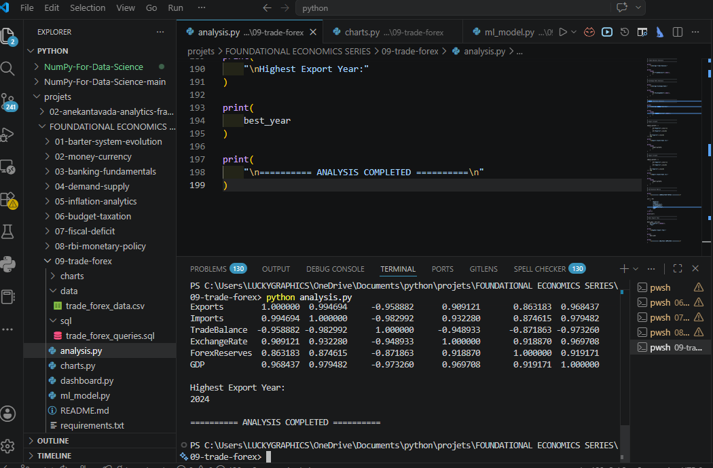
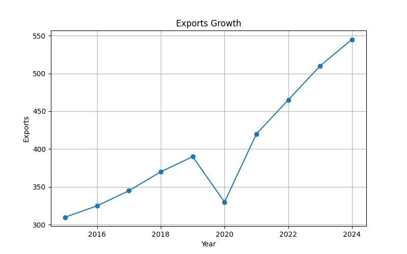
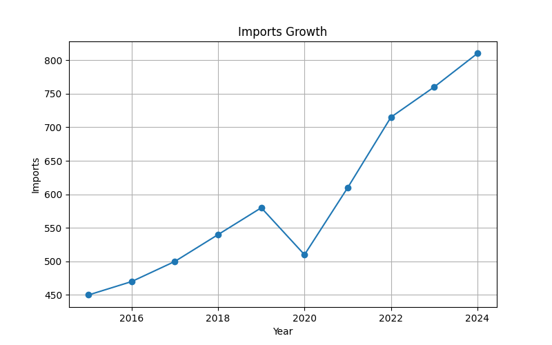
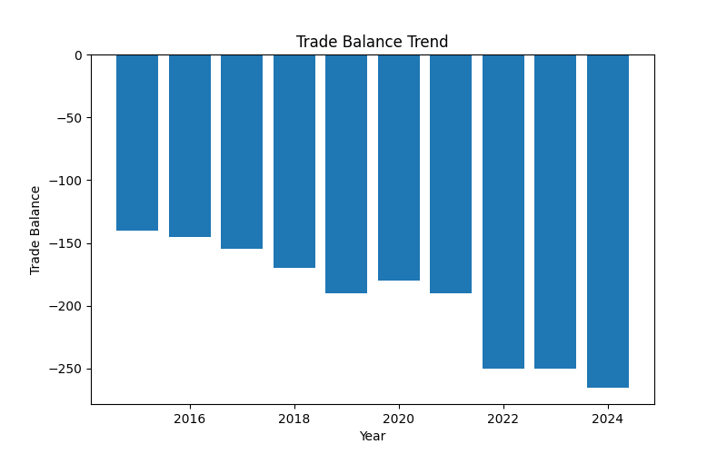
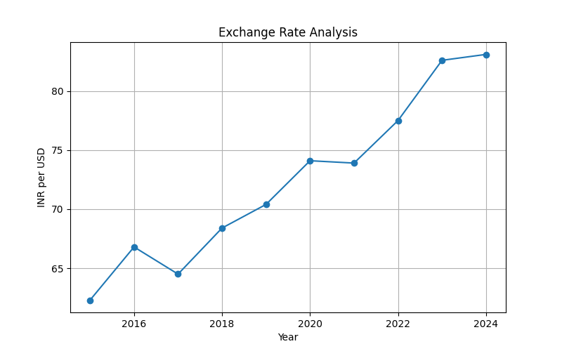
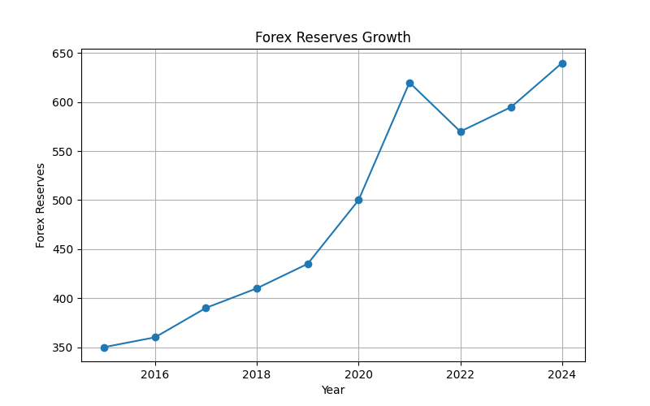
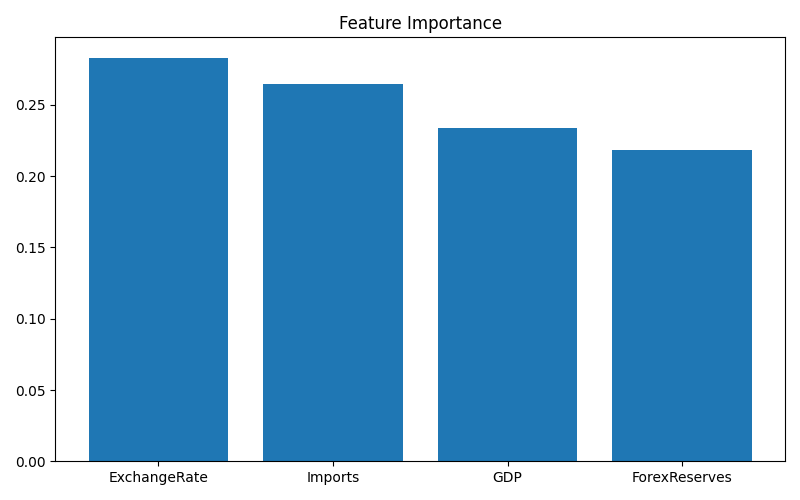
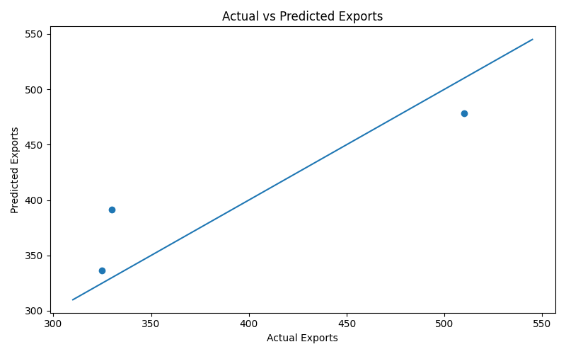

# 🌍 Trade & Forex Analytics

## 📖 Project Overview

International trade and foreign exchange markets are essential drivers of economic growth, global competitiveness, and currency stability.

This project analyzes exports, imports, trade balance, exchange rates, foreign exchange reserves, and GDP trends using Data Analytics, Statistics, SQL, Machine Learning, Data Visualization, and an Interactive Dashboard.

The objective is to transform international trade and forex concepts into practical analytics applications using Python and modern data science tools.

---

# 🎯 Objectives

- Analyze export growth trends
- Study import patterns
- Evaluate trade deficits and trade balance
- Examine exchange rate movements
- Analyze forex reserve growth
- Perform statistical analysis
- Apply SQL analytics
- Build machine learning prediction models
- Develop interactive dashboards

---

# 📚 Source of Data

The dataset used in this project is an educational dataset created for learning and analytical purposes based on publicly available international trade and forex concepts.

## Reference Sources

- Reserve Bank of India (RBI)
- Ministry of Commerce & Industry
- Directorate General of Foreign Trade (DGFT)
- World Bank Open Data
- International Monetary Fund (IMF)
- World Trade Organization (WTO)
- UNCTAD Trade Statistics
- Investopedia International Trade Resources

## Dataset Nature

- Educational Dataset
- Publicly Inspired Economic Indicators
- Learning Purpose Only
- Not Official Government Statistics

---

# 🛠 Technologies Used

## Programming

- Python

## Data Analysis

- Pandas
- NumPy

## Visualization

- Matplotlib
- Plotly

## Machine Learning

- Scikit-Learn
- Random Forest Regressor

## Dashboard Development

- Streamlit

## Database Analytics

- SQL

---

# 📂 Project Structure

```text
09-trade-forex/
│
├── data/
│   └── trade_forex_data.csv
│
├── charts/
│   ├── exports_growth.png
│   ├── imports_growth.png
│   ├── trade_balance_trend.png
│   ├── exchange_rate_analysis.png
│   ├── forex_reserves_growth.png
│   ├── feature_importance.png
│   ├── ml_prediction.png
│   ├── dashboard_preview.png
│   └── trade_forex_terminal_output.png
│
├── sql/
│   └── trade_forex_queries.sql
│
├── analysis.py
├── charts.py
├── ml_model.py
├── dashboard.py
├── requirements.txt
└── README.md
```

---

# 📊 Dataset Description

The dataset contains yearly international trade and forex indicators.

| Column        | Description                  |
|-------------- |-----------------------------|
| Year          | Observation Year             |
| Exports       | Total Exports                |
| Imports       | Total Imports                |
| TradeBalance  | Exports − Imports            |
| ExchangeRate  | INR per USD                  |
| ForexReserves | Foreign Exchange Reserves    |
| GDP           | Gross Domestic Product       |

---

# 📈 Economic Concepts Covered

## International Trade

International trade refers to the exchange of goods and services between countries.

### Benefits

- Economic Growth
- Market Expansion
- Employment Generation
- Technology Transfer

---

## Exports

Exports are goods and services sold to foreign countries.

### Importance

- Earn Foreign Currency
- Improve Trade Performance
- Support Domestic Industries
- Increase GDP

---

## Imports

Imports are goods and services purchased from foreign countries.

### Importance

- Meet Domestic Demand
- Access Advanced Technology
- Improve Consumer Choice

---

## Trade Balance

Trade Balance = Exports − Imports

### Positive Trade Balance

Trade Surplus

### Negative Trade Balance

Trade Deficit

---

## Foreign Exchange Reserves

Forex reserves are foreign currency assets held by a country's central bank.

### Functions

- Currency Stability
- External Debt Payments
- Import Financing
- Crisis Management

---

## Exchange Rate

Exchange Rate determines the value of one currency relative to another.

### Influencing Factors

- Inflation
- Interest Rates
- Trade Flows
- Capital Movements

---

# 📉 Statistical Analysis

The project performs:

- Descriptive Statistics
- Export Analysis
- Import Analysis
- Trade Balance Analysis
- Exchange Rate Analysis
- Forex Reserve Analysis
- Growth Rate Analysis
- Correlation Analysis

### Example Metrics

- Average Exports
- Average Imports
- Average Trade Balance
- Average Exchange Rate
- Average Forex Reserves
- Export Growth Rate
- Import Growth Rate
- Correlation Matrix

---

# 📊 Data Visualizations

The project automatically generates the following charts.

---

## Terminal Output



---

## 1. Exports Growth



Tracks export performance over time.

---

## 2. Imports Growth



Shows import growth trends.

---

## 3. Trade Balance Trend



Measures trade surplus or deficit.

---

## 4. Exchange Rate Analysis



Tracks INR exchange rate movements.

---

## 5. Forex Reserves Growth



Shows foreign exchange reserve accumulation.

---

## 6. Feature Importance



Displays important variables influencing export predictions.

---

## 7. Machine Learning Prediction



Compares actual and predicted export values.

---

# 🤖 Machine Learning Model

The project uses Machine Learning to predict future export performance.

## Algorithm

Random Forest Regressor

## Features

- Imports
- Exchange Rate
- Forex Reserves
- GDP

## Target

- Exports

## Outputs

- R² Score
- Future Export Prediction
- Feature Importance
- Actual vs Predicted Comparison

### Example Prediction Output

```text
========== ML RESULTS ==========

R2 Score: 0.95

Predicted Exports

2025 : 575

2026 : 610

========== MODEL COMPLETED ==========
```

---

# 🗄 SQL Analytics

The project includes SQL queries for trade and forex analysis.

### Example Queries

```sql
SELECT AVG(Exports)
FROM trade_forex_data;
```

```sql
SELECT AVG(Imports)
FROM trade_forex_data;
```

```sql
SELECT AVG(TradeBalance)
FROM trade_forex_data;
```

```sql
SELECT AVG(ExchangeRate)
FROM trade_forex_data;
```

```sql
SELECT AVG(ForexReserves)
FROM trade_forex_data;
```

### SQL Insights

- Export Analysis
- Import Analysis
- Trade Balance Tracking
- Exchange Rate Analysis
- Forex Reserve Growth
- Export Ranking
- Import Ranking
- Economic Summary Reports

---

# 📷 Project Outputs

## Terminal Output

Running:

```bash
python analysis.py
```

Example:

```text
========== TRADE & FOREX ANALYSIS ==========

Average Exports:
421.00

Average Imports:
594.50

Average Trade Balance:
-193.50

Average Exchange Rate:
72.36

Average Forex Reserves:
487.00

Export Growth Rate:
75.81

Import Growth Rate:
80.00

========== ANALYSIS COMPLETED ==========
```

---

## Generated Charts

Running:

```bash
python charts.py
```

Creates:

```text
exports_growth.png
imports_growth.png
trade_balance_trend.png
exchange_rate_analysis.png
forex_reserves_growth.png
feature_importance.png
ml_prediction.png
```

---

## Machine Learning Output

Running:

```bash
python ml_model.py
```

Generates:

```text
Future Export Prediction
Feature Importance Analysis
Actual vs Predicted Visualization
R² Score Evaluation
```

---

## Dashboard Output

Running:

```bash
streamlit run dashboard.py
```

Launches an interactive dashboard featuring:

- Dataset Explorer
- Statistical Summary
- Export Analysis
- Import Analysis
- Trade Balance Analysis
- Exchange Rate Analysis
- Forex Reserve Analysis
- Correlation Matrix
- Machine Learning Results
- SQL Query Explorer
- Economic Insights

Dashboard Screenshot:

```text
charts/dashboard_preview.png
```

---

# 🌐 Dashboard Features

### 📋 Dataset Explorer

Explore complete trade and forex data.

### 📊 Statistical Summary

View descriptive statistics instantly.

### 📈 Export Analysis

Track export growth and performance.

### 📉 Import Analysis

Monitor import trends.

### 🌍 Trade Balance Analysis

Understand trade surplus and deficit movements.

### 💱 Exchange Rate Analysis

Analyze currency value fluctuations.

### 💰 Forex Reserve Analysis

Track reserve accumulation and stability.

### 🤖 Machine Learning Results

Explore future export forecasts.

### 🗄 SQL Query Explorer

Review trade and forex SQL queries.

---

# ▶ How To Run

## Install Dependencies

```bash
pip install -r requirements.txt
```

## Run Statistical Analysis

```bash
python analysis.py
```

## Generate Charts

```bash
python charts.py
```

## Run Machine Learning

```bash
python ml_model.py
```

## Launch Dashboard

```bash
streamlit run dashboard.py
```

---

# 🎓 Learning Outcomes

After completing this project, learners will understand:

- International Trade Concepts
- Export and Import Analysis
- Trade Deficit and Trade Balance
- Exchange Rate Dynamics
- Forex Reserve Management
- Statistical Analysis
- SQL Analytics
- Data Visualization
- Machine Learning Prediction
- Dashboard Development

---

# 🌍 Real-World Applications

This project can be applied in:

- International Trade Research
- Foreign Exchange Analysis
- Economic Policy Studies
- Financial Market Research
- Academic Learning
- Data Analytics Training
- Dashboard Development
- Economic Forecasting

---

# 👩‍💻 Author

**Saloni Tiwari**

🎓 IIT Madras BS in Data Science

🎓 B.Sc Mathematics (Magadh University)

### Skills

- Python
- NumPy
- Pandas
- Matplotlib
- SQL
- Statistics
- Data Analytics
- Machine Learning (Learning)
- Data Structures & Algorithms (Learning)
- DBMS (Learning)

---

# ⭐ Project Status

✅ Completed

Part of the **Foundational Economics Series**, a collection of economics analytics projects built using Python, Statistics, SQL, Machine Learning, Data Visualization, and Interactive Dashboards.

---

## 🚀 Learning Economics Through Data Analytics
